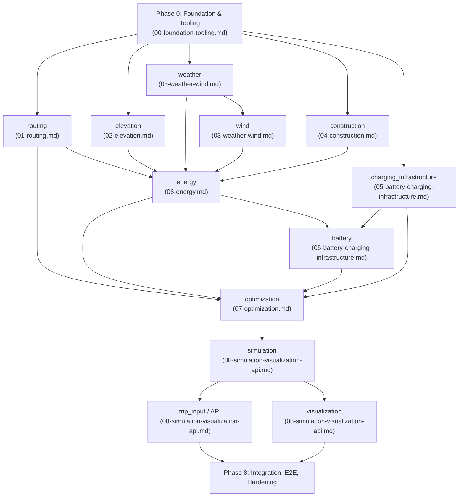

# Implementation Plan: Tesla Trip Planner

> **Status:** Master plan, derived from `01`–`06`. This document is the authoritative entry point for implementation; the detailed plans are located under `docs/plans/`. This is a planning artifact, not an implementation artifact — no code exists in the repository yet.

## 1. Objectives and Approach

This plan covers **everything** from `01-project-specifications.md` through `06-open-points-contradictions.md`: all 12 functional modules, the two-phase architecture model (routing → energy/charging optimization), iterative ETA/weather resolution, the repository/tooling foundation, and the agent guidelines. It was developed iteratively:

1. Analysis of all six documents and derivation of a **canonical type registry** and **phase roadmap** (Sections 3–4), so that nine parallel-working sub-agents can build consistently on the same interfaces.
2. Nine specialized sub-agents each researched a module cluster (external APIs, concrete library syntax, physical formulas) and wrote a complete implementation plan under `docs/plans/`.
3. Consistency review of all nine plans against each other (type names, coordinate convention, cross-module signatures) — identified inconsistencies were corrected directly in the source files (Section 6).
4. This document summarizes the results and makes the decisions from `06-open-points-contradictions.md` binding.

## 2. Phase Roadmap



| Phase | Module                                    | Can be parallelized with                                       | Detailed plan                                      |
| ----- | ----------------------------------------- | -------------------------------------------------------------- | -------------------------------------------------- |
| 0     | Foundation & Tooling                      | — (prerequisite for everything)                                | `docs/plans/00-foundation-tooling.md`              |
| 1     | `routing` (+ OSM pipeline)                | elevation, weather, construction, charging_infrastructure      | `docs/plans/01-routing.md`                         |
| 1     | `elevation` (+ DEM pipeline)              | routing, weather, construction, charging_infrastructure        | `docs/plans/02-elevation.md`                       |
| 1     | `weather`                                 | routing, elevation, construction, charging_infrastructure      | `docs/plans/03-weather-wind.md`                    |
| 1     | `construction`                            | routing, elevation, weather, charging_infrastructure           | `docs/plans/04-construction.md`                    |
| 1     | `charging_infrastructure`                 | routing, elevation, weather, construction                      | `docs/plans/05-battery-charging-infrastructure.md` |
| 2     | `wind`                                    | — (requires stable `weather.models`)                           | `docs/plans/03-weather-wind.md`                    |
| 3     | `energy`                                  | — (requires routing, elevation, weather, wind, construction)   | `docs/plans/06-energy.md`                          |
| 4     | `battery`                                 | — (requires energy, charging_infrastructure)                   | `docs/plans/05-battery-charging-infrastructure.md` |
| 5     | `optimization`                            | — (requires routing, energy, battery, charging_infrastructure) | `docs/plans/07-optimization.md`                    |
| 6     | `simulation`                              | — (requires optimization output)                               | `docs/plans/08-simulation-visualization-api.md`    |
| 7     | `trip_input` / API, `visualization`       | trip_input ∥ visualization (both depend only on simulation)    | `docs/plans/08-simulation-visualization-api.md`    |
| 8     | Integration/E2E, hardening, documentation | —                                                              | see Section 8                                      |

**Critical path:** Phase 0 → routing/elevation/weather → wind → energy → battery → optimization → simulation → (trip_input ∥ visualization). Five modules in Phase 1 are freely parallelizable from a dependency perspective — when multiple developers/agents are available, they should be started simultaneously.

## 3. Canonical Type Registry

Each type has exactly one owning module; other modules import it exclusively from that module's `models.py`.

| Type                                                             | Module (`tripplanner.<module>.models`)                                     |
| ---------------------------------------------------------------- | -------------------------------------------------------------------------- |
| `Coordinate` (primitive, not a business type)                    | `tripplanner.geo` (exception to the module-boundary rule, see Section 6.1) |
| `TripRequest`, `Waypoint`, `VehicleProfile`                      | `trip_input`                                                               |
| `Route`, `RouteSegment` (including `bearing_deg`, `oberflaeche`) | `routing`                                                                  |
| `ElevationPoint`, `SegmentGradient`                              | `elevation`                                                                |
| `WeatherQuery`, `WeatherSample`                                  | `weather`                                                                  |
| `WindComponents`                                                 | `wind`                                                                     |
| `ConstructionZone`, `Sperrungstyp`, `Land`                       | `construction`                                                             |
| `VehicleEnergyParameters`, `SegmentEnergyResult`                 | `energy`                                                                   |
| `SoCState`, `ChargingCurvePoint`, `ChargingCurve`                | `battery`                                                                  |
| `ChargingStation`, `StallType`, `ConnectorType`                  | `charging_infrastructure`                                                  |
| `ChargingPlan`, `ChargingStop`, `OptimizationConstraints`        | `optimization`                                                             |
| `SimulationFrame`, `TripSimulationResult`                        | `simulation`                                                               |

**Coordinate convention (binding, project-wide):** Every `Coordinate` tuple is `(lat, lon)`. Exceptions exist only at three documented external boundaries, and nowhere else:

* GraphHopper request payload (`points: [[lon, lat], …]`) — conversion in `routing/client.py`.
* `rasterio` pixel lookup (`src.index(lon, lat)`) — internally in `elevation/providers.py`.
* MapLibre/GeoJSON rendering (`[lng, lat]`) — conversion exclusively in `frontend/src/utils/geo-utils.ts::toLngLat()`.

## 4. Module Skeleton Convention

```text
src/tripplanner/<module>/
├── __init__.py        # re-exports the public API
├── models.py          # Pydantic models — the only cross-module interface
├── <module>.py        # core logic / public functions
├── providers.py       # only for external data sources: Protocol + implementation + fake
└── client.py          # HTTP/IO client (if applicable)
tests/<module>/
├── test_<module>.py
├── test_providers.py
└── conftest.py
tests/fixtures/<module>/     # recorded responses, sample files
```

Rule: No module accesses the internal implementation details of another module; it may only use its `models.py`. The sole exception is `tripplanner.geo` (Section 6.1). The complete directory tree, including all 12 modules + `geo`, is specified in `docs/plans/00-foundation-tooling.md`, Section 3.

## 5. Detailed Plans at a Glance

| File                                               | Modules                                           | Core content                                                                                                                                                                           |
| -------------------------------------------------- | ------------------------------------------------- | -------------------------------------------------------------------------------------------------------------------------------------------------------------------------------------- |
| `docs/plans/00-foundation-tooling.md`              | Foundation                                        | Complete directory tree, `pyproject.toml`, `hk.pkl`, `.github/workflows/ci.yml` (GraphHopper image `israelhikingmap/graphhopper:11.0`), full `AGENTS.md`, mkdocs setup, 13 tasks       |
| `docs/plans/01-routing.md`                         | `routing`                                         | GraphHopper v11 Docker setup, `custom_model` JSON for Tesla Model 3, Geofabrik OSM extracts DE/DK/SE, `/route` API client, 15 tasks                                                    |
| `docs/plans/02-elevation.md`                       | `elevation`                                       | Copernicus DEM GLO-30 via AWS Open Data (`copernicus-dem-30m`), rasterio workflow, gradient formula, 12 tasks                                                                          |
| `docs/plans/03-weather-wind.md`                    | `weather`, `wind`                                 | Open-Meteo Forecast API (endpoints, parameters, batching, rate limits), iterative re-querying, wind projection trigonometry, 14 tasks                                                  |
| `docs/plans/04-construction.md`                    | `construction`                                    | DATEX II v3.3, national access points (DE: MDM/Mobilithek, DK: Vejdirektoratet, SE: Trafikverket), shared `xmlschema` parser, 14 tasks                                                 |
| `docs/plans/05-battery-charging-infrastructure.md` | `battery`, `charging_infrastructure`              | Local JSON snapshot (supercharge.info-compatible), piecewise-linear charging curve, charging-duration integration, 14 tasks                                                            |
| `docs/plans/06-energy.md`                          | `energy`                                          | Complete formula derivation (rolling resistance, aerodynamic drag including wind component, gradient, regenerative braking, HVAC), Tesla Model 3 default values with sources, 14 tasks |
| `docs/plans/07-optimization.md`                    | `optimization`                                    | State-space discretization (segment × SoC bucket × time bucket), NetworkX A* prototype, OR-Tools CP-SAT extension, iteration loop, 14 tasks                                            |
| `docs/plans/08-simulation-visualization-api.md`    | `simulation`, `visualization`, `trip_input` / API | Time-series reconstruction, FastAPI + Typer CLI orchestration of the 11 data-flow steps, MapLibre setup, JSON Schema → TypeScript, 24 tasks                                            |

**Total scope:** 134 implementation-ready, TDD-ordered tasks across all nine plans.

## 6. Consolidation Corrections from the Consistency Review

The nine plans were developed independently; the consistency review (Step 3 of the approach) identified three genuine cross-plan inconsistencies, which were corrected directly in the source files:

### 6.1 Missing `bearing_deg` Field

`03-weather-wind.md` assumed `RouteSegment.bearing_deg` for wind projection, but the field was missing from the `RouteSegment` model in `01-routing.md`. **Resolved:** `RouteSegment` now has a required `bearing_deg` field (forward bearing, calculated by the `routing` module); `01-routing.md` has a corresponding Task 15, and `03-weather-wind.md` consistently references `bearing_deg` rather than `bearing`.

### 6.2 Incorrect `Coordinate` Import Source

`03-weather-wind.md` incorrectly imported `Coordinate` from `trip_input.models` or `weather.models`. **Resolved:** `tripplanner.geo` was introduced as a minimal, dependency-free geo primitive module (`Coordinate`, `bearing_deg()`, `haversine_distance_m()`) in Phase 0 — the only deliberate exception to the “`models.py` only” rule, because it is not business logic but a utility library analogous to `datetime`. All plans now reference `tripplanner.geo.Coordinate` as the source of truth; `routing.models` retains a structurally identical local alias with an explicit reference to `tripplanner.geo` as the eventual consolidation source.

### 6.3 Inverted Coordinate Order (lat/lon vs. lon/lat)

`08-simulation-visualization-api.md` had specified `SimulationFrame.position`, the API models, and the frontend types consistently as `(lon, lat)` (GeoJSON convention), contradicting `routing`, `elevation`, `weather`, and `charging_infrastructure`, all of which use `(lat, lon)` (with validators that check latitude first). Without correction, this would have caused swapped coordinates (the classic lat/lon swap bug). **Resolved:** The internal domain model consistently uses `(lat, lon)`; GeoJSON/MapLibre conversion to `(lon, lat)` now occurs exclusively through a newly specified `toLngLat()` utility in `frontend/src/utils/geo-utils.ts`, applied exactly at the rendering boundary (markers, route GeoJSON). CLI parsing, API field descriptions, and the position interpolation formula were corrected accordingly.

### 6.4 Missing Road Surface (`surface`) as an Input Variable

`01-project-specifications.md` explicitly lists “surfaces” among the required OSM data and “road surface” as an influence factor for energy consumption (the “OSM Data” and “Energy Consumption” sections). Cross-checking all nine plans against `01`–`03` revealed that `RouteSegment` had no surface field, meaning `energy` could not use it — a genuine coverage gap, not merely a cross-plan inconsistency. **Resolved:** `RouteSegment.oberflaeche` (from the GraphHopper path detail `surface`) was added to `01-routing.md` (including Task 15 for implementation), and `06-energy.md` received a multiplicative road-surface factor `f_oberflaeche()` in the rolling-resistance formula (Section 5.1.1, Task 15), along with two corresponding tests.

These four corrections have already been applied to the respective `docs/plans/*.md` files — this section documents them only for traceability.

## 7. Open Issues from `06-open-points-contradictions.md` — Binding Decisions

All six issues were answered by the project owner and are incorporated into all nine detailed plans as settled decisions rather than open questions:

1. **Iterative ETA/weather convergence:** The approach from `02-architecture.md` is confirmed. The threshold (default 30 min) and maximum iteration count (default 3) are configurable parameters, not hardcoded values. Implemented in `optimization` (control flow) and `weather` (`refetch_weather`/`fetch_weather_iterative`).
2. **Route remains fixed after GraphHopper:** No energy-optimal rerouting is in the current scope. Multiple route alternatives + energy-based selection is explicitly documented as a possible future extension, but is not planned (`01-routing.md`, “Out of Scope” section).
3. **Tesla Supercharger data source:** A local JSON snapshot (format compatible with supercharge.info) is the current assumption. The `ChargingStationProvider` interface encapsulates access so that a future crawler plugin can be introduced without changes to consumers. No crawler is included in this plan (`05-battery-charging-infrastructure.md`).
4. **Waypoint ≠ charging stop:** Option (a) is confirmed — waypoints are independent mandatory route points with an optional minimum dwell time, independent of but combinable with a charging stop. They are modeled as separate nodes in the state graph (`07-optimization.md`).
5. **Calibration is optional:** The `energy` module starts with fixed, but externalized, values provided as a `VehicleEnergyParameters` Pydantic object with documented defaults (not inline magic numbers). Actual calibration from driving data is not a required deliverable (`06-energy.md`).
6. **Uncertainty is not modeled per source:** The only intended safeguard is the SoC safety reserve (`OptimizationConstraints.sicherheitsreserve_pct`) in `optimization`. There is no separate uncertainty model for construction, weather, or battery degradation.

## 8. Phase 8 — Integration, E2E, Hardening (Not Part of the Nine Detailed Plans)

This phase is not included in any cluster plan because it only makes sense after all modules have been completed:

* **End-to-end test:** Complete `trip_input` → `simulation` execution for a real route (e.g. Berlin → Copenhagen, with a waypoint), against real local services (`@pytest.mark.integration`: GraphHopper container, real DEM tiles, fake or recorded weather/construction/charging-infrastructure data).
* **Optimization regression suite:** Hand-verified small scenarios from Section 6 of `07-optimization.md` as permanent regression tests.
* **Frontend E2E:** Playwright suite (already specified in Section 6 of `08-simulation-visualization-api.md`) against the running FastAPI endpoint.
* **Documentation:** `mkdocs serve` with a complete API reference generated from docstrings (mkdocstrings), plus a README with setup instructions.
* **Not part of this phase or any later phase within the current scope** (see Section 7): energy-optimal rerouting, Tesla Supercharger crawler, live traffic, calibration from driving data, per-source uncertainty modeling.

## 9. Execution Recommendation

The following applies to each of the nine detailed plans (`docs/plans/*.md`): Every task checklist is already TDD-ordered (write the test → make it fail → implement → make it pass → `uv run hk check --all` → commit) and references concrete files, signatures, and acceptance criteria — no plan contains placeholders. Recommended approach:

1. **Phase 0 first, sequentially, by one agent/developer:** The foundation is a prerequisite for all other phases and is created only once.
2. **Phase 1 parallel fan-out:** Assign one agent/developer to each module (`routing`, `elevation`, `weather`, `construction`, `charging_infrastructure`), as they have no runtime dependencies on one another according to the dependency graph (Section 2) — only their `models.py` interfaces need to be stabilized first (already fixed in Section 3).
3. **Phases 2–7 sequentially** according to the dependency graph; `trip_input`/API and `visualization` (both Phase 7) can again run in parallel.
4. **Within each plan:** Execute tasks in the specified order (write test → make it fail → implement → green → `uv run hk check --all` → commit), following the Definition of Done from `docs/05-agent-guidelines.md` or the future `AGENTS.md` (full text in `docs/plans/00-foundation-tooling.md`, Section 5).
5. **After each module:** Run `uv run pytest -m "not integration"` and verify the 85% coverage gate locally before starting the next dependent module.
