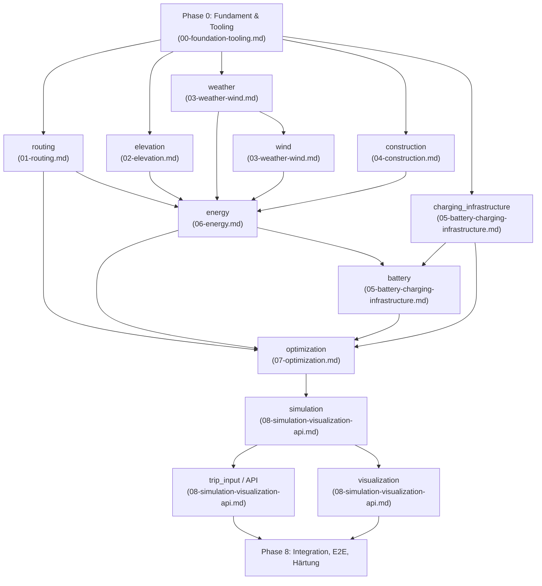

# Implementierungsplan: Tesla-Tripplaner

> **Status:** Master-Plan, abgeleitet aus `01`–`06`. Dieses Dokument ist der verbindliche Einstiegspunkt für die Umsetzung; die Detailpläne liegen unter `docs/plans/`. Es handelt sich um einen Planungs-, kein Implementierungsartefakt — es existiert noch kein Code im Repo.

## 1. Zielsetzung und Vorgehen

Dieser Plan deckt **alles** aus `01-projektspezifikation.md` bis `06-offene-punkte-widersprueche.md` ab: alle 12 fachlichen Module, das Zwei-Phasen-Architekturmodell (Routing → Energie-/Lade-Optimierung), die iterative ETA-/Wetter-Auflösung, das Repo-/Tooling-Fundament und die Agenten-Leitlinien. Er wurde iterativ erarbeitet:

1. Analyse aller sechs Dokumente und Ableitung eines **kanonischen Typ-Registers** und einer **Phasen-Roadmap** (Abschnitt 3–4), damit neun parallel arbeitende Subagenten widerspruchsfrei auf denselben Schnittstellen aufbauen.
2. Neun spezialisierte Subagenten haben je einen Modul-Cluster recherchiert (externe APIs, konkrete Bibliotheks-Syntax, physikalische Formeln) und einen vollständigen Implementierungsplan unter `docs/plans/` geschrieben.
3. Konsistenzprüfung aller neun Pläne gegeneinander (Typnamen, Koordinatenkonvention, Cross-Modul-Signaturen) — gefundene Widersprüche wurden direkt in den Quelldateien korrigiert (Abschnitt 6).
4. Dieses Dokument fasst die Ergebnisse zusammen und verankert die Antworten aus `06-offene-punkte-widersprueche.md` verbindlich.

## 2. Phasen-Roadmap



| Phase | Module | Parallelisierbar mit | Detailplan |
|---|---|---|---|
| 0 | Fundament & Tooling | — (Voraussetzung für alles) | `docs/plans/00-foundation-tooling.md` |
| 1 | `routing` (+OSM-Pipeline) | elevation, weather, construction, charging_infrastructure | `docs/plans/01-routing.md` |
| 1 | `elevation` (+DEM-Pipeline) | routing, weather, construction, charging_infrastructure | `docs/plans/02-elevation.md` |
| 1 | `weather` | routing, elevation, construction, charging_infrastructure | `docs/plans/03-weather-wind.md` |
| 1 | `construction` | routing, elevation, weather, charging_infrastructure | `docs/plans/04-construction.md` |
| 1 | `charging_infrastructure` | routing, elevation, weather, construction | `docs/plans/05-battery-charging-infrastructure.md` |
| 2 | `wind` | — (braucht `weather.models` stabil) | `docs/plans/03-weather-wind.md` |
| 3 | `energy` | — (braucht routing, elevation, weather, wind, construction) | `docs/plans/06-energy.md` |
| 4 | `battery` | — (braucht energy, charging_infrastructure) | `docs/plans/05-battery-charging-infrastructure.md` |
| 5 | `optimization` | — (braucht routing, energy, battery, charging_infrastructure) | `docs/plans/07-optimization.md` |
| 6 | `simulation` | — (braucht optimization-Output) | `docs/plans/08-simulation-visualization-api.md` |
| 7 | `trip_input`/API, `visualization` | trip_input ∥ visualization (beide nur von simulation abhängig) | `docs/plans/08-simulation-visualization-api.md` |
| 8 | Integration/E2E, Härtung, Doku | — | siehe Abschnitt 8 |

**Kritischer Pfad:** Phase 0 → routing/elevation/weather → wind → energy → battery → optimization → simulation → (trip_input ∥ visualization). Fünf Module in Phase 1 sind aus Abhängigkeitssicht beliebig parallelisierbar — bei mehreren Entwicklern/Agenten sollten sie gleichzeitig begonnen werden.

## 3. Kanonisches Typ-Register

Jeder Typ hat genau ein besitzendes Modul; andere Module importieren ihn ausschließlich aus dessen `models.py`.

| Typ | Modul (`tripplanner.<modul>.models`) |
|---|---|
| `Coordinate` (Primitiv, kein Business-Typ) | `tripplanner.geo` (Ausnahme von der Modulgrenzen-Regel, s. Abschnitt 6.1) |
| `TripRequest`, `Waypoint`, `VehicleProfile` | `trip_input` |
| `Route`, `RouteSegment` (inkl. `bearing_deg`, `oberflaeche`) | `routing` |
| `ElevationPoint`, `SegmentGradient` | `elevation` |
| `WeatherQuery`, `WeatherSample` | `weather` |
| `WindComponents` | `wind` |
| `ConstructionZone`, `Sperrungstyp`, `Land` | `construction` |
| `VehicleEnergyParameters`, `SegmentEnergyResult` | `energy` |
| `SoCState`, `ChargingCurvePoint`, `ChargingCurve` | `battery` |
| `ChargingStation`, `StallType`, `ConnectorType` | `charging_infrastructure` |
| `ChargingPlan`, `ChargingStop`, `OptimizationConstraints` | `optimization` |
| `SimulationFrame`, `TripSimulationResult` | `simulation` |

**Koordinatenkonvention (verbindlich, projektweit):** Jedes `Coordinate`-Tupel ist `(lat, lon)`. Ausnahmen nur an drei dokumentierten externen Grenzen, nirgends sonst:
- GraphHopper-Request-Payload (`points: [[lon, lat], …]`) — Konvertierung in `routing/client.py`.
- `rasterio`-Pixel-Lookup (`src.index(lon, lat)`) — intern in `elevation/providers.py`.
- MapLibre/GeoJSON-Rendering (`[lng, lat]`) — Konvertierung ausschließlich in `frontend/src/utils/geo-utils.ts::toLngLat()`.

## 4. Modul-Skeleton-Konvention

```
src/tripplanner/<modul>/
├── __init__.py        # re-exportiert öffentliche API
├── models.py           # Pydantic-Modelle — einzige Cross-Modul-Schnittstelle
├── <modul>.py           # Kernlogik / öffentliche Funktionen
├── providers.py          # nur bei externer Datenquelle: Protocol + Implementierung + Fake
└── client.py               # HTTP/IO-Client (falls vorhanden)
tests/<modul>/
├── test_<modul>.py
├── test_providers.py
└── conftest.py
tests/fixtures/<modul>/     # aufgezeichnete Antworten, Beispieldateien
```

Regel: Kein Modul greift auf interne Implementierungsdetails eines anderen Moduls zu, ausschließlich auf `models.py`. Einzige Ausnahme: `tripplanner.geo` (Abschnitt 6.1). Vollständiger Verzeichnisbaum inkl. aller 12 Module + `geo`: `docs/plans/00-foundation-tooling.md`, Abschnitt 3.

## 5. Detailpläne im Überblick

| Datei | Module | Kerninhalt |
|---|---|---|
| `docs/plans/00-foundation-tooling.md` | Fundament | Vollständiger Verzeichnisbaum, `pyproject.toml`, `hk.pkl`, `.github/workflows/ci.yml` (GraphHopper-Image `israelhikingmap/graphhopper:11.0`), `AGENTS.md`-Volltext, mkdocs-Setup, 13 Tasks |
| `docs/plans/01-routing.md` | `routing` | GraphHopper-v11-Docker-Setup, `custom_model`-JSON für Tesla Model 3, Geofabrik-OSM-Extrakte DE/DK/SE, `/route`-API-Client, 15 Tasks |
| `docs/plans/02-elevation.md` | `elevation` | Copernicus DEM GLO-30 via AWS Open Data (`copernicus-dem-30m`), rasterio-Workflow, Steigungsformel, 12 Tasks |
| `docs/plans/03-weather-wind.md` | `weather`, `wind` | Open-Meteo Forecast-API (Endpunkte, Parameter, Batching, Rate-Limits), iterative Re-Abfrage, Wind-Projektionstrigonometrie, 14 Tasks |
| `docs/plans/04-construction.md` | `construction` | DATEX II v3.3, nationale Zugangspunkte (DE: MDM/Mobilithek, DK: Vejdirektoratet, SE: Trafikverket), gemeinsamer `xmlschema`-Parser, 14 Tasks |
| `docs/plans/05-battery-charging-infrastructure.md` | `battery`, `charging_infrastructure` | Lokaler JSON-Snapshot (supercharge.info-kompatibel), stückweise lineare Ladekurve, Ladedauer-Integration, 14 Tasks |
| `docs/plans/06-energy.md` | `energy` | Vollständige Formelherleitung (Rollwiderstand, Luftwiderstand inkl. Windkomponente, Steigung, Rekuperation, HVAC), Tesla-Model-3-Defaultwerte mit Quellen, 14 Tasks |
| `docs/plans/07-optimization.md` | `optimization` | Zustandsraum-Diskretisierung (Segment × SoC-Bucket × Zeit-Bucket), NetworkX-A*-Prototyp, OR-Tools-CP-SAT-Ausbaustufe, Iterationsschleife, 14 Tasks |
| `docs/plans/08-simulation-visualization-api.md` | `simulation`, `visualization`, `trip_input`/API | Zeitreihen-Rekonstruktion, FastAPI+Typer-CLI-Orchestrierung der 11 Datenfluss-Schritte, MapLibre-Setup, JSON-Schema→TypeScript, 24 Tasks |

**Gesamtumfang:** 134 umsetzungsreife, TDD-geordnete Tasks über alle neun Pläne.

## 6. Konsolidierungskorrekturen aus der Konsistenzprüfung

Die neun Pläne wurden unabhängig voneinander erarbeitet; die Konsistenzprüfung (Schritt 3 im Vorgehen) fand drei echte Cross-Plan-Widersprüche, die direkt in den Quelldateien behoben wurden:

### 6.1 Fehlendes `bearing_deg`-Feld
`03-weather-wind.md` setzte für die Windprojektion `RouteSegment.bearing_deg` voraus, das Feld fehlte aber in `01-routing.md`s `RouteSegment`-Modell. **Behoben:** `RouteSegment` hat jetzt ein Pflichtfeld `bearing_deg` (Vorwärtsazimut, vom `routing`-Modul berechnet); `01-routing.md` hat einen entsprechenden Task 15, `03-weather-wind.md` referenziert konsistent `bearing_deg` statt `bearing`.

### 6.2 Falsche `Coordinate`-Importquelle
`03-weather-wind.md` importierte `Coordinate` fälschlich aus `trip_input.models` bzw. `weather.models`. **Behoben:** Einführung von `tripplanner.geo` als minimales, abhängigkeitsfreies Geo-Primitiv-Modul (`Coordinate`, `bearing_deg()`, `haversine_distance_m()`) in Phase 0 — die einzige bewusste Ausnahme von der „nur `models.py`"-Regel, da es sich nicht um Geschäftslogik, sondern um eine Utility-Bibliothek analog zu `datetime` handelt. Alle Pläne referenzieren jetzt `tripplanner.geo.Coordinate` als Quelle der Wahrheit; `routing.models` behält lokal einen strukturgleichen Alias mit explizitem Verweis auf `tripplanner.geo` als spätere Konsolidierungsquelle.

### 6.3 Invertierte Koordinatenreihenfolge (lat/lon vs. lon/lat)
`08-simulation-visualization-api.md` hatte `SimulationFrame.position`, die API-Modelle und die Frontend-Typen durchgängig als `(lon, lat)` (GeoJSON-Konvention) spezifiziert — im Widerspruch zu `routing`, `elevation`, `weather` und `charging_infrastructure`, die alle `(lat, lon)` verwenden (mit Validatoren, die Breitengrad zuerst prüfen). Ohne Korrektur hätte das zu vertauschten Koordinaten geführt (klassischer Lat/Lon-Swap-Bug). **Behoben:** Internes Domänenmodell ist durchgängig `(lat, lon)`; die GeoJSON-/MapLibre-Konvertierung `(lon, lat)` erfolgt jetzt ausschließlich über eine neu spezifizierte `toLngLat()`-Utility in `frontend/src/utils/geo-utils.ts`, angewendet exakt an der Rendering-Grenze (Marker, Route-GeoJSON). CLI-Parsing, API-Feldbeschreibungen und die Positions-Interpolationsformel wurden entsprechend korrigiert.

### 6.4 Fehlender Straßenbelag (`Straßenbelag`/`Oberflächen`) als Einflussgröße
`01-projektspezifikation.md` nennt „Oberflächen" explizit als benötigte OSM-Daten und „Straßenbelag" als Einflussgröße auf den Energieverbrauch (Abschnitte „OSM-Daten" und „Energieverbrauch"). Der Abgleich aller neun Pläne gegen `01`–`03` zeigte, dass `RouteSegment` kein Oberflächen-Feld hatte und `energy` es folglich nicht verwenden konnte — eine echte Abdeckungslücke, kein reiner Cross-Plan-Widerspruch. **Behoben:** `RouteSegment.oberflaeche` (aus GraphHopper Path-Detail `surface`) in `01-routing.md` ergänzt (inkl. Task 15 zur Umsetzung), `06-energy.md` erhielt einen multiplikativen Straßenbelag-Faktor `f_oberflaeche()` in der Rollwiderstandsformel (Abschnitt 5.1.1, Task 15) mit zwei zugehörigen Tests.

Diese vier Korrekturen sind bereits in den jeweiligen `docs/plans/*.md`-Dateien angewendet — dieser Abschnitt dokumentiert sie nur zur Nachvollziehbarkeit.

## 7. Offene Punkte aus `06-offene-punkte-widersprueche.md` — verbindliche Entscheidungen

Alle sechs Punkte wurden vom Projektverantwortlichen beantwortet und sind in allen neun Detailplänen als feststehende Entscheidung (nicht als offene Frage) berücksichtigt:

1. **Iterative ETA/Wetter-Konvergenz:** Ansatz aus `02-architektur.md` bestätigt. Schwellwert (Default 30 min) und maximale Iterationszahl (Default 3) sind konfigurierbare Parameter, kein Hardcode. Implementiert in `optimization` (Kontrollfluss) und `weather` (`refetch_weather`/`fetch_weather_iterative`).
2. **Route bleibt nach GraphHopper fixiert:** Kein energieoptimales Rerouting im aktuellen Scope. Mehrere Routenalternativen + energetische Auswahl ist eine explizit dokumentierte, aber nicht geplante spätere Ausbaustufe (`01-routing.md`, Abschnitt „Nicht-Scope").
3. **Tesla-Supercharger-Datenquelle:** Lokaler JSON-Snapshot (Format kompatibel zu supercharge.info) als aktuelle Annahme. `ChargingStationProvider`-Interface kapselt den Zugriff, sodass ein späteres Crawler-Plugin ohne Konsumenten-Änderung eingesetzt werden kann. Kein Crawler in diesem Plan (`05-battery-charging-infrastructure.md`).
4. **Zwischenstopp ≠ Ladestopp:** Variante (a) bestätigt — Zwischenstopps sind eigenständige Pflicht-Wegpunkte mit optionaler Mindestaufenthaltsdauer, unabhängig aber kombinierbar mit einem Ladehalt. Als eigene Knoten im Zustandsgraphen modelliert (`07-optimization.md`).
5. **Kalibrierbarkeit optional:** `energy`-Modul startet mit fest verdrahteten, aber als `VehicleEnergyParameters`-Pydantic-Objekt mit dokumentierten Defaults ausgelagerten Werten (nicht als Inline-Magic-Numbers). Echte Kalibrierung aus Fahrdaten ist keine Pflicht-Deliverable (`06-energy.md`).
6. **Datenunsicherheit nicht pro Quelle modelliert:** Einzige vorgesehene Absicherung ist die SoC-Sicherheitsreserve (`OptimizationConstraints.sicherheitsreserve_pct`) in `optimization`. Keine gesonderte Unsicherheitsmodellierung für Baustellen, Wetter oder Batteriedegradation.

## 8. Phase 8 — Integration, E2E, Härtung (nicht Teil der neun Detailpläne)

Diese Phase ist in keinem Cluster-Plan enthalten, da sie erst nach Abschluss aller Module sinnvoll ist:

- **End-to-End-Test:** Vollständiger Durchlauf `trip_input` → `simulation` für eine reale Strecke (z. B. Berlin → Kopenhagen, mit Zwischenstopp), gegen echte lokale Dienste (`@pytest.mark.integration`: GraphHopper-Container, echte DEM-Kacheln, Fake- oder aufgezeichnete Wetter-/Baustellen-/Ladeinfrastrukturdaten).
- **Regressions-Suite für `optimization`:** Handverifizierte Kleinszenarien aus `07-optimization.md` Abschnitt 6 als dauerhafte Regressionstests.
- **Frontend-E2E:** Playwright-Suite (bereits in `08-simulation-visualization-api.md` Abschnitt 6 spezifiziert) gegen den laufenden FastAPI-Endpunkt.
- **Dokumentation:** `mkdocs serve` mit vollständiger API-Referenz aus Docstrings (mkdocstrings), README mit Setup-Anleitung.
- **Nicht Teil dieser oder einer späteren Phase im aktuellen Scope** (siehe Abschnitt 7): energieoptimales Rerouting, Tesla-Supercharger-Crawler, Live-Verkehr, Kalibrierung aus Fahrdaten, Per-Quelle-Unsicherheitsmodellierung.

## 9. Ausführungsempfehlung

Für jeden der neun Detailpläne (`docs/plans/*.md`) gilt: Jede Aufgaben-Checkliste ist bereits TDD-geordnet (Test vor Implementierung) und referenziert konkrete Dateien, Signaturen und Akzeptanzkriterien — kein Plan enthält Platzhalter. Empfohlenes Vorgehen:

1. **Phase 0 zuerst, sequenziell, von einem Agenten/Entwickler:** Fundament ist Voraussetzung für alle anderen Phasen und wird nur einmal angelegt.
2. **Phase 1 (fünf Module) parallel fanout:** Je ein Agent/Entwickler pro Modul (`routing`, `elevation`, `weather`, `construction`, `charging_infrastructure`), da sie laut Abhängigkeitsgraph (Abschnitt 2) keine gegenseitigen Laufzeitabhängigkeiten haben — nur die `models.py`-Schnittstellen müssen vorab stabil sein (bereits in Abschnitt 3 fixiert).
3. **Phasen 2–7 sequenziell** gemäß Abhängigkeitsgraph; `trip_input`/API und `visualization` (beide Phase 7) können wieder parallel laufen.
4. **Innerhalb jedes Plans:** Tasks in der angegebenen Reihenfolge abarbeiten (Test schreiben → fehlschlagen lassen → implementieren → grün → `uv run hk check --all` → Commit), gemäß Definition of Done aus `docs/05-agent-guidelines.md` bzw. der künftigen `AGENTS.md` (Volltext in `docs/plans/00-foundation-tooling.md`, Abschnitt 5).
5. **Nach jedem Modul:** `uv run pytest -m "not integration"` und Coverage-Gate (85 %) lokal prüfen, bevor das nächste abhängige Modul begonnen wird.
