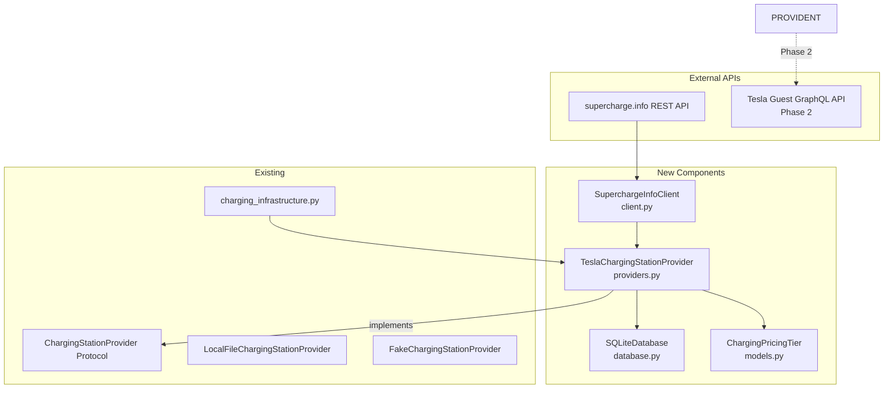

# Plan: Tesla Supercharger Provider (SQLite-based)

---

## 1. Purpose & Scope

Extension of the `charging_infrastructure` module with a **persistent, live-updatable Tesla Supercharger provider** that uses a local SQLite database as persistent storage — replacing the pure JSON snapshot approach with a structured, indexed database with two tables: `charging_stations` (location data) and `charging_pricing` (time-based pricing).

**Key decision:** The provider operates from the local SQLite database by default (no live request during normal operation). An explicit `refresh()` call fetches fresh data from the public supercharge.info API and writes it persistently into the SQLite database. This follows the principle required in AGENTS.md: "local, persistent, updated only when needed".

**Boundary:**

- This document does *not* replace the existing `LocalFileChargingStationProvider` — this remains as a simple JSON-based provider (for tests without a DB, minimal setup).
- The new `TeslaChargingStationProvider` is the recommendation for production / integration tests.
- `FakeChargingStationProvider` remains unchanged for unit tests.
- Pricing data (Tesla Guest GraphQL) is planned as a second phase, since the Tesla API is behind Akamai WAF and requires a browser fallback (Safari/Playwright).

---

## 2. Architecture



---

## 3. SQLite Database Schema

The database is located at `data/tesla_superchargers.db` (configurable via `data_path`).

### Table: `charging_stations`

```sql
CREATE TABLE IF NOT EXISTS charging_stations (
    id                     INTEGER PRIMARY KEY AUTOINCREMENT,
    supercharge_info_id    INTEGER UNIQUE NOT NULL,
    tesla_location_id      TEXT,
    site_name              TEXT NOT NULL,
    latitude               REAL NOT NULL,
    longitude              REAL NOT NULL,
    country_code           TEXT NOT NULL,
    stalls_v2              INTEGER DEFAULT 0,
    stalls_v3              INTEGER DEFAULT 0,
    stalls_v3_ultra        INTEGER DEFAULT 0,
    stalls_v4              INTEGER DEFAULT 0,
    total_stalls           INTEGER DEFAULT 0,
    power_kilowatt         INTEGER DEFAULT 0,
    status                 TEXT NOT NULL DEFAULT 'OPEN',
    connector_types        TEXT NOT NULL DEFAULT '[]',
    ist_24_7               INTEGER DEFAULT 1,
    date_opened            TEXT,
    last_updated_utc       TEXT NOT NULL
);

CREATE INDEX IF NOT EXISTS idx_stations_coord
    ON charging_stations(latitude, longitude);

CREATE INDEX IF NOT EXISTS idx_stations_country
    ON charging_stations(country_code);

CREATE INDEX IF NOT EXISTS idx_stations_status
    ON charging_stations(status);
```

**Mapping supercharge.info → SQLite:**

| supercharge.info Field | SQLite Column | Transformation |
| --- | --- | --- |
| `id` | `supercharge_info_id` | Direct, as INTEGER |
| `locationId` | `tesla_location_id` | String, may be NULL |
| `name` | `site_name` | Direct |
| `gps.latitude` | `latitude` | Direct |
| `gps.longitude` | `longitude` | Direct |
| `address.country` → ISO-2 | `country_code` | From `country` (USA→US, Germany→DE via mapping) |
| `stalls.v2` | `stalls_v2` | 0 if missing |
| `stalls.v3` | `stalls_v3` | 0 if missing |
| `stalls.v3` (at >250kW) | `stalls_v3_ultra` | See Stall Type Detection |
| `stalls.v4` | `stalls_v4` | 0 if missing |
| `stallCount` | `total_stalls` | Direct |
| `powerKilowatt` | `power_kilowatt` | Per-stall peak power |
| `status` | `status` | OPEN→OPEN, CONSTRUCTION→CONSTRUCTION, etc. |
| `plugs.*` | `connector_types` | JSON array of plug types with count>0 |
| `dateOpened` | `date_opened` | ISO date or NULL |

**Stall Type Detection from `powerKilowatt`:**

Since supercharge.info groups all V3 stalls together in `stalls.v3` (including ones we designate as `V3_ULTRA`), we classify based on rated power:

| `powerKilowatt` | Stall Type |
| --- | --- |
| ≤150 kW | `V2` |
| 151-250 kW | `V3` |
| 251-350 kW | `V3_ULTRA` |
| ≥351 kW | `V4` |

This is an approximation — exact type classification requires Tesla-owned data. But the values are sufficient since `powerKilowatt` is the per-stall rated power.

**Country Mapping:**

supercharge.info uses full country names (`"Germany"`, `"Denmark"`, `"Sweden"`). A fixed mapping in `database.py` converts to ISO-2 codes. Unknown countries → `"XX"`.

```python
_COUNTRY_MAP: dict[str, str] = {
    "Germany": "DE",
    "Denmark": "DK",
    "Sweden": "SE",
    "Austria": "AT",
    "Switzerland": "CH",
    "Netherlands": "NL",
    "France": "FR",
    "Italy": "IT",
    "Spain": "ES",
    "Poland": "PL",
    "Czech Republic": "CZ",
    "Slovakia": "SK",
    "Hungary": "HU",
    "Slovenia": "SI",
    "Croatia": "HR",
    "Belgium": "BE",
    "Luxembourg": "LU",
    "United Kingdom": "GB",
    "Norway": "NO",
    "Finland": "FI",
    "Iceland": "IS",
    "Lithuania": "LT",
    "Latvia": "LV",
    "Estonia": "EE",
    "Romania": "RO",
    "Bulgaria": "BG",
    "Greece": "GR",
    "Portugal": "PT",
    "Ireland": "IE",
    "Andorra": "AD",
}
```

### Table: `charging_pricing`

```sql
CREATE TABLE IF NOT EXISTS charging_pricing (
    id                   INTEGER PRIMARY KEY AUTOINCREMENT,
    supercharge_info_id  INTEGER NOT NULL,
    tier_label           TEXT NOT NULL,
    time_label           TEXT,
    currency             TEXT NOT NULL,
    amount               REAL NOT NULL,
    unit                 TEXT NOT NULL CHECK (unit IN ('kWh', 'min')),
    idle_fee_text        TEXT,
    last_updated_utc     TEXT NOT NULL,
    FOREIGN KEY (supercharge_info_id)
        REFERENCES charging_stations(supercharge_info_id)
        ON DELETE CASCADE
);

CREATE INDEX IF NOT EXISTS idx_pricing_station
    ON charging_pricing(supercharge_info_id);
```

**Data Source (Phase 2):**

- Tesla Guest GraphQL API (`getGuestChargingSiteDetails`)
- Behind Akamai WAF — requires browser fallback (Safari via AppleScript or Playwright)
- Pricing tiers: `"Charging Fees for Tesla Owner"`, `"Charging Fees for Other EV"`
- Rate windows: time-based pricing (e.g. `"4:00 PM - 8:00 PM"`)

A pricing record represents exactly one rate window of a tier:

| Field | Example |
| --- | --- |
| `tier_label` | `"Charging Fees for Tesla Owner"` |
| `time_label` | `"4:00 PM - 8:00 PM"` (or NULL for flat rate) |
| `currency` | `"EUR"`, `"SEK"`, `"DKK"` |
| `amount` | `0.39` (€/kWh) |
| `unit` | `"kWh"` or `"min"` |
| `idle_fee_text` | `"0.50 €/min idle"` (or NULL) |

### Metadata Table (optional but recommended)

```sql
CREATE TABLE IF NOT EXISTS db_meta (
    key   TEXT PRIMARY KEY,
    value TEXT NOT NULL
);
```

Stores:

- `schema_version` — for migrations
- `last_full_refresh_utc` — timestamp of the last full API fetch
- `station_count` — number of stations (redundancy for quick check)
- `data_source` — `"supercharge.info"`

---

## 4. New Data Models (Pydantic, in `models.py`)

Extension of the existing `models.py` with pricing models:

```python
class ChargingPricingTier(BaseModel):
    """A pricing tier with optional time-based rates.

    Can represent a flat rate (time_label=None) or time-dependent rates.
    """

    tier_label: str = Field(
        ...,
        description='Name of the pricing tier, e.g. "Charging Fees for Tesla Owner"',
    )
    time_label: str | None = Field(
        default=None,
        description=(
            'Time window as text, e.g. "4:00 PM - 8:00 PM". None = flat rate (always valid)'
        ),
    )
    currency: str = Field(
        ...,
        min_length=3,
        max_length=3,
        description="Currency as ISO-4217 code (EUR, SEK, DKK, ...)",
    )
    amount: float = Field(
        ...,
        gt=0,
        description="Price per unit (e.g. 0.39 EUR/kWh)",
    )
    unit: Literal["kWh", "min"] = Field(
        ...,
        description='Billing unit: "kWh" (energy) or "min" (time)',
    )
    idle_fee_text: str | None = Field(
        default=None,
        description="Idle fee as raw text, e.g. '0.50 EUR/min idle'",
    )

class ChargingStationWithPricing(BaseModel):
    """ChargingStation with associated pricing data."""

    station: ChargingStation
    pricing: list[ChargingPricingTier] = Field(
        default_factory=list,
        description="Pricing information for this station",
    )
```

---

## 5. Component Details

### 5.1 `client.py` — SuperchargeInfoClient

```python
class SuperchargeInfoClient:
    """HTTP client for the supercharge.info REST API.

    The API is public, requires no API key, and does not block simple
    HTTP clients (no WAF). Documented endpoints:
    - /service/supercharge/allSites   → full data set
    - /service/supercharge/databaseInfo → change timestamp
    - /service/supercharge/allChanges  → delta changes
    """

    BASE_URL = "https://supercharge.info/service/supercharge"

    def __init__(self, client: httpx.AsyncClient | None = None) -> None: ...

    async def fetch_all_sites(self) -> list[dict]:
        """Fetches the full data set of all supercharger locations.

        Returns: Raw JSON list (each element a site dict)
        """

    async def fetch_database_info(self) -> dict:
        """Fetches the last modification timestamp of the database.

        Returns: {"lastModified": timestamp_ms, "lastModifiedString": str}
        """

    async def fetch_all_changes(self) -> list[dict]:
        """Fetches the list of all changes/transitions.

        Returns: List of change records
        """

    async def close(self) -> None:
        """Closes the HTTP client session."""
```

**Response structure `allSites` (excerpt):**

```json
{
  "id": 2204,
  "locationId": "ashburnsupercharger",
  "name": "Ashburn, VA",
  "status": "OPEN",
  "address": {
    "country": "USA",
    "region": "North America"
  },
  "gps": { "latitude": 39.008, "longitude": -77.502 },
  "stallCount": 8,
  "powerKilowatt": 250,
  "stalls": { "v3": 8 },
  "plugs": { "nacs": 8, "ccs1": 8, "multi": 8 },
  "dateOpened": "2020-02-20",
  "elevationMeters": 99,
  "battery": false,
  "solarCanopy": false,
  "otherEVs": true
}
```

### 5.2 `database.py` — SQLiteDatabase

```python
class SQLiteDatabase:
    """Manages the local SQLite database for supercharger data.

    Creates tables on first initialization, provides CRUD access
    for stations and pricing. Transaction-based — refresh() runs in
    a single transaction.
    """

    def __init__(self, db_path: Path) -> None:
        """Opens/creates the SQLite database.

        Args:
            db_path: Path to the .db file (Default: data/tesla_superchargers.db)
        """

    def initialize(self) -> None:
        """Creates tables and indexes if they don't exist.
        May be called multiple times (IF NOT EXISTS).
        """

    def load_stations(
        self,
        country_filter: set[str] | None = None,
    ) -> list[dict]:
        """Loads all stations from the DB (as raw dicts for ChargingStation mapping).
        Cached by the provider and converted to ChargingStation objects.
        """

    def load_pricing(
        self,
        supercharge_info_ids: set[int] | None = None,
    ) -> dict[int, list[ChargingPricingTier]]:
        """Loads pricing data for one or all stations.
        Returns: dict mapping supercharge_info_id → list[ChargingPricingTier]
        """

    def replace_all_stations(self, stations: list[dict]) -> None:
        """Replaces the entire station set in a transaction.
        - Deletes all existing stations (CASCADE also deletes pricing)
        - Inserts the passed stations
        - Updates db_meta
        """

    def upsert_pricing(
        self,
        supercharge_info_id: int,
        tiers: list[ChargingPricingTier],
    ) -> None:
        """Replaces pricing data for a station.
        (Phase 2: separate pricing refresh without station refresh)
        """

    def get_meta(self, key: str) -> str | None:
        """Reads a metadata value."""

    def set_meta(self, key: str, value: str) -> None:
        """Writes a metadata value."""

    def close(self) -> None:
        """Closes the DB connection."""

    @property
    def station_count(self) -> int:
        """Returns the number of stored stations."""

    @property
    def last_refresh_utc(self) -> datetime | None:
        """Returns the timestamp of the last refresh."""
```

**Transaction logic `replace_all_stations`:**

```python
def replace_all_stations(self, stations: list[dict]) -> None:
    cursor = self._conn.cursor()
    cursor.execute("BEGIN")
    try:
        cursor.execute("DELETE FROM charging_pricing")
        cursor.execute("DELETE FROM charging_stations")
        for s in stations:
            cursor.execute(
                """
                INSERT INTO charging_stations (
                    supercharge_info_id, tesla_location_id, site_name,
                    latitude, longitude, country_code,
                    stalls_v2, stalls_v3, stalls_v3_ultra, stalls_v4,
                    total_stalls, power_kilowatt, status,
                    connector_types, ist_24_7, date_opened, last_updated_utc
                ) VALUES (?, ?, ?, ?, ?, ?, ?, ?, ?, ?, ?, ?, ?, ?, ?, ?, ?)
            """,
                (...),
            )
        cursor.execute(
            """
            INSERT OR REPLACE INTO db_meta (key, value)
            VALUES ('last_full_refresh_utc', ?)
        """,
            (datetime.now(UTC).isoformat(),),
        )
        self._conn.commit()
    except Exception:
        self._conn.rollback()
        raise
```

### 5.3 `providers.py` — TeslaChargingStationProvider

```python
class TeslaChargingStationProvider(ChargingStationProvider):
    """Implementation that reads supercharger data from a local SQLite DB
    and updates via supercharge.info API when needed.

    Default: reads from data/tesla_superchargers.db (creates database on
    first access automatically and loads initial data).

    Usage:
        provider = TeslaChargingStationProvider()
        # Auto init: checks DB → if empty, fetches from API
        stations = await provider.get_stations_in_radius((52.5, 13.4), 10)

        # Manual refresh:
        await provider.refresh()
    """

    def __init__(
        self,
        db_path: Path | None = None,
        client: SuperchargeInfoClient | None = None,
    ) -> None:
        """Initializes the provider.

        Args:
            db_path: Path to the SQLite DB. Default: data/tesla_superchargers.db
            client: Optional HTTP client (for tests with mock). Otherwise auto.
        """

    async def refresh(self) -> int:
        """Fetches current data from supercharge.info and writes it to the DB.

        Flow:
        1. Fetch all sites via SuperchargeInfoClient
        2. Filter for Europe (address.region == "Europe")
        3. Map each site to our internal dict format
        4. Call SQLiteDatabase.replace_all_stations()
        5. Update db_meta

        Returns:
            Number of stored stations
        """

    async def get_stations_in_radius(
        self,
        coordinate: Coordinate,
        radius_km: float,
        country_filter: Literal["DE", "DK", "SE"] | None = None,
    ) -> list[ChargingStation]:
        """Reads from SQLite, filters by radius + country, sorted by distance.
        Like LocalFileChargingStationProvider, but from DB instead of JSON.
        """

    async def get_stations_along_route(
        self,
        route: Any,
        search_radius_km: float = 2.0,
    ) -> dict[int, list[ChargingStation]]:
        """Like LocalFileChargingStationProvider, segment centers + radius."""
```

**Mapping supercharge.info → ChargingStation:**

```python
@staticmethod
def _site_to_charging_station(site: dict) -> ChargingStation:
    """Converts a supercharge.info site dict into a ChargingStation model."""

    # Derive stall type distribution from powerKilowatt
    power = site.get("powerKilowatt", 250)
    if power <= 150:
        stall_type = StallType.V2
    elif power <= 250:
        stall_type = StallType.V3
    elif power <= 350:
        stall_type = StallType.V3_ULTRA
    else:
        stall_type = StallType.V4

    # Map total stalls to detected type
    total = site.get("stallCount", 0)
    stalls = {
        StallType.V2: site.get("stalls", {}).get("v2", 0),
        StallType.V3: site.get("stalls", {}).get("v3", 0) if power <= 250 else 0,
        StallType.V3_ULTRA: site.get("stalls", {}).get("v3", 0) if 250 < power <= 350 else 0,
        StallType.V4: site.get("stalls", {}).get("v4", 0),
    }

    # Extract connector types from plugs
    plugs = site.get("plugs", {})
    connector_map = {
        "nacs": ConnectorType.NACS,
        "ccs1": ConnectorType.CCS1,
        "ccs2": ConnectorType.CCS2,
        "type2": ConnectorType.TYPE2,
        "gbt": ConnectorType.GB_T,
        "chademo": ConnectorType.CHADEMO,
        "tpc": ConnectorType.TESLA,
    }
    connector_types = [
        connector_map[k] for k, v in plugs.items() if v and v > 0 and k in connector_map
    ]
    if not connector_types:
        connector_types = [ConnectorType.CCS2]  # Fallback for Europe

    # Status mapping
    status_map = {
        "OPEN": "online",
        "CONSTRUCTION": "maintenance",
        "PERMIT": "online",
        "TEMP_CLOSED": "temporarily_closed",
        "PLAN": "online",
    }
    status = status_map.get(site.get("status", "OPEN"), "online")

    # Country code
    country = _COUNTRY_MAP.get(site.get("address", {}).get("country", ""), "XX")

    return ChargingStation(
        station_id=str(site["id"]),
        name=f"Tesla Supercharger - {site['name']}",
        coordinate=(
            site["gps"]["latitude"],
            site["gps"]["longitude"],
        ),
        stalls=stalls,
        max_ladeleistung_kw=float(total * power),
        connector_types=connector_types,
        country=country,
        ist_24_7=True,
        status=status,
        letzte_datenAktualisierung=datetime.now(UTC),
    )
```

### 5.4 `charging_infrastructure.py` — Adaptation

The existing helper functions (`init_charging_infrastructure`, `get_stations_in_radius`, `get_stations_along_route`) need to be extended to also use `TeslaChargingStationProvider` as the default. The `init_charging_infrastructure` function gets a `provider_type` parameter:

```python
def init_charging_infrastructure(
    data_path: Path | None = None,
    provider_type: Literal["local_file", "tesla_db"] = "tesla_db",
) -> None:
```

With `"tesla_db"`, `TeslaChargingStationProvider` is used with the SQLite DB; with `"local_file"` the existing `LocalFileChargingStationProvider` with JSON is used.

---

## 6. Refresh Logic in Detail

```python
async def refresh(self) -> int:
    """Full refresh of all supercharger data from supercharge.info."""

    # 1. Fetch all sites
    raw_sites = await self._client.fetch_all_sites()

    # 2. Filter Europe
    euro_sites = [s for s in raw_sites if s.get("address", {}).get("region") == "Europe"]

    # 3. Map to DB dicts
    db_records = [_site_to_db_record(s) for s in euro_sites]

    # 4. Write to DB in transaction
    self._db.replace_all_stations(db_records)

    # 5. Invalidate in-memory cache
    self._stations = None

    return len(db_records)

def _site_to_db_record(site: dict) -> dict:
    """Converts a supercharge.info dict into a DB record dict."""
    gps = site["gps"]
    address = site.get("address", {})
    plugs = site.get("plugs", {})

    connector_types = json.dumps(
        [
            k
            for k, v in plugs.items()
            if v and v > 0 and k in ("nacs", "ccs1", "ccs2", "type2", "gbt", "chademo", "tpc")
        ]
        or ["ccs2"]
    )

    return {
        "supercharge_info_id": site["id"],
        "tesla_location_id": site.get("locationId"),
        "site_name": site["name"],
        "latitude": gps["latitude"],
        "longitude": gps["longitude"],
        "country_code": _COUNTRY_MAP.get(address.get("country", ""), "XX"),
        "stalls_v2": site.get("stalls", {}).get("v2", 0),
        "stalls_v3": site.get("stalls", {}).get("v3", 0),
        "stalls_v3_ultra": 0,  # supercharge.info has no separate v3ultra
        "stalls_v4": site.get("stalls", {}).get("v4", 0),
        "total_stalls": site.get("stallCount", 0),
        "power_kilowatt": site.get("powerKilowatt", 250),
        "status": site.get("status", "OPEN"),
        "connector_types": connector_types,
        "ist_24_7": 1,
        "date_opened": site.get("dateOpened"),
        "last_updated_utc": datetime.now(UTC).isoformat(),
    }
```

---

## 7. Interface with Existing Components

### `__init__.py` — new Exports

```python
from .database import SQLiteDatabase
from .client import SuperchargeInfoClient
from .providers import (
    LocalFileChargingStationProvider,
    FakeChargingStationProvider,
    TeslaChargingStationProvider,
)
from .models import (
    ChargingStation,
    ChargingStationProvider,
    ChargingPricingTier,
    ChargingStationWithPricing,
    ConnectorType,
    StallType,
)

__all__ = [
    "ChargingStation",
    "ChargingPricingTier",
    "ChargingStationProvider",
    "ChargingStationWithPricing",
    "ConnectorType",
    "FakeChargingStationProvider",
    "LocalFileChargingStationProvider",
    "SQLiteDatabase",
    "StallType",
    "SuperchargeInfoClient",
    "TeslaChargingStationProvider",
    "get_charging_stations_along_route",
    "get_charging_stations_in_radius",
    "init_charging_infrastructure",
]
```

### Dependencies on Other Modules

| Module | Usage |
| --- | --- |
| `tripplanner.geo` | `Coordinate`, `haversine_distance_m()` for radius search |
| `tripplanner.routing.models` | `Route` (for `get_stations_along_route`) |
| `httpx` | HTTP client for supercharge.info API (already in `pyproject.toml`) |
| `sqlite3` | Python standard library — no new dependency |

---

## 8. Test Strategy

### 8.1 New Tests

| Test File | What is tested |
| --- | --- |
| `tests/charging_infrastructure/test_client.py` | `SuperchargeInfoClient` with recorded API response |
| `tests/charging_infrastructure/test_database.py` | `SQLiteDatabase`: table creation, CRUD, transaction, country mapping |
| `tests/charging_infrastructure/test_providers.py` (extended) | `TeslaChargingStationProvider`: refresh, mapping, radius search, country filter |

### 8.2 Test Fixtures (new)

| Fixture File | Content |
| --- | --- |
| `tests/fixtures/charging_infrastructure/supercharge_info_response_3sites.json` | 3 supercharge.info sites (DE, DK, SE, various stall types) for mock tests |
| `tests/fixtures/charging_infrastructure/supercharge_info_dbinfo.json` | Example response from `/databaseInfo` |

### 8.3 Test Cases `test_client.py`

```python
class TestSuperchargeInfoClient:
    """Tests for the supercharge.info API HTTP client."""

    async def test_fetch_all_sites_returns_list(self, mock_client):
        """Checks that allSites returns a list."""
        sites = await mock_client.fetch_all_sites()
        assert isinstance(sites, list)
        assert len(sites) > 0

    async def test_fetch_all_sites_structure(self, mock_client, sample_site):
        """Checks the structure of a site entry (required fields)."""
        sites = await mock_client.fetch_all_sites()
        site = sites[0]
        assert "id" in site
        assert "gps" in site
        assert "latitude" in site["gps"]
        assert "longitude" in site["gps"]
        assert "address" in site
        assert "region" in site["address"]
        assert "stallCount" in site
        assert "powerKilowatt" in site

    async def test_fetch_database_info(self, mock_client):
        """Checks the databaseInfo endpoint."""
        info = await mock_client.fetch_database_info()
        assert "lastModified" in info
        assert isinstance(info["lastModified"], int)
```

### 8.4 Test Cases `test_database.py`

```python
class TestSQLiteDatabase:
    """Tests for the SQLite database manager."""

    async def test_initialize_creates_tables(self, tmp_db):
        """Checks that initialize() creates all tables."""
        tmp_db.initialize()
        tables = tmp_db._cursor.execute(
            "SELECT name FROM sqlite_master WHERE type='table'"
        ).fetchall()
        table_names = {t[0] for t in tables}
        assert "charging_stations" in table_names
        assert "charging_pricing" in table_names
        assert "db_meta" in table_names

    async def test_replace_all_stations(self, tmp_db, sample_db_records):
        """Checks replace_all_stations in a transaction."""
        tmp_db.initialize()
        count = tmp_db.replace_all_stations(sample_db_records)
        assert count == len(sample_db_records)
        assert tmp_db.station_count == len(sample_db_records)

    async def test_replace_all_stations_is_idempotent(self, tmp_db, sample_db_records):
        """Calling replace_all_stations twice = same as once."""
        tmp_db.initialize()
        tmp_db.replace_all_stations(sample_db_records)
        tmp_db.replace_all_stations(sample_db_records)
        assert tmp_db.station_count == len(sample_db_records)

    async def test_load_stations_country_filter(self, tmp_db, sample_db_records):
        """Checks country_filter when loading."""
        tmp_db.initialize()
        tmp_db.replace_all_stations(sample_db_records)
        de_only = tmp_db.load_stations(country_filter={"DE"})
        assert all(r["country_code"] == "DE" for r in de_only)
```

### 8.5 Test Cases `test_providers.py` (extended)

```python
class TestTeslaChargingStationProvider:
    """Tests for TeslaChargingStationProvider."""

    async def test_refresh_filters_europe(self, provider_with_mock_client):
        """Checks that only European sites make it into the DB."""
        count = await provider_with_mock_client.refresh()
        assert count > 0
        # USA sites from the mock response were filtered out

    async def test_get_stations_in_radius(self, provider_with_seeded_db):
        """Radius search from the SQLite DB."""
        stations = await provider_with_seeded_db.get_stations_in_radius((52.5, 13.4), 10.0)
        assert len(stations) >= 1
        assert stations[0].country == "DE"

    async def test_get_stations_in_radius_empty(self, provider_with_seeded_db):
        """Empty result for too small a radius."""
        stations = await provider_with_seeded_db.get_stations_in_radius(
            (48.0, 2.0),
            1.0,  # Paris, probably no stations in the fixture
        )
        assert len(stations) == 0

    async def test_station_mapping(self, provider_with_seeded_db):
        """Checks correct mapping from supercharge.info → ChargingStation."""
        stations = await provider_with_seeded_db.get_stations_in_radius((52.5, 13.4), 200.0)
        station = stations[0]
        assert isinstance(station.station_id, str)
        assert isinstance(station.max_ladeleistung_kw, float)
        assert station.max_ladeleistung_kw > 0
        assert len(station.stalls) > 0

    async def test_auto_init_creates_db_if_empty(self, tmp_path):
        """With empty DB + missing client: auto init attempt."""
        db_path = tmp_path / "test_empty.db"
        # Provider with empty DB path and client=None
        # Should not raise an exception, but return an empty station list
        provider = TeslaChargingStationProvider(db_path=db_path)
        stations = await provider.get_stations_in_radius((52.5, 13.4), 10.0)
        assert stations == []
```

### 8.6 Test Fixture for supercharge.info API Response

The test fixture contains 3 minimal, realistic site entries — one per country (DE, DK, SE). A fourth entry is "USA" (not Europe) to test the Europe filter:

```json
[
  {
    "id": 3506,
    "locationId": "BarcelonaUrbanessupercharger",
    "name": "Barcelona, Spain - L'Illa Diagonal",
    "status": "OPEN",
    "address": {
      "country": "Spain",
      "region": "Europe"
    },
    "gps": { "latitude": 41.3895, "longitude": 2.1337 },
    "stallCount": 4,
    "powerKilowatt": 125,
    "stalls": { "v2": 4 },
    "plugs": { "ccs2": 4, "type2": 4 },
    "dateOpened": "2021-07-01"
  },
  {
    "id": 1234,
    "name": "Testville, USA",
    "status": "OPEN",
    "address": {
      "country": "USA",
      "region": "North America"
    },
    "gps": { "latitude": 39.0, "longitude": -77.5 },
    "stallCount": 8,
    "powerKilowatt": 250,
    "stalls": { "v3": 8 },
    "plugs": { "nacs": 8 },
    "dateOpened": "2022-01-01"
  },
  {
    "id": 5678,
    "locationId": "kopenhagensupercharger",
    "name": "Copenhagen, Denmark",
    "status": "OPEN",
    "address": {
      "country": "Denmark",
      "region": "Europe"
    },
    "gps": { "latitude": 55.6761, "longitude": 12.5683 },
    "stallCount": 8,
    "powerKilowatt": 250,
    "stalls": { "v3": 8 },
    "plugs": { "ccs2": 8, "type2": 8 },
    "dateOpened": "2019-06-15"
  },
  {
    "id": 9012,
    "locationId": "malmosupercharger",
    "name": "Malmö, Sweden",
    "status": "OPEN",
    "address": {
      "country": "Sweden",
      "region": "Europe"
    },
    "gps": { "latitude": 55.5941, "longitude": 13.0039 },
    "stallCount": 8,
    "powerKilowatt": 250,
    "stalls": { "v3": 8 },
    "plugs": { "ccs2": 8, "type2": 8 },
    "dateOpened": "2020-03-20"
  }
]
```

---

## 9. Task Checklist

### Phase 1: Data Models

- [ ] Task 1.1: Extend `src/tripplanner/charging_infrastructure/models.py` with `ChargingPricingTier` and `ChargingStationWithPricing`
- [ ] Task 1.2: Write tests for new models (validation, serialization)

### Phase 2: Client

- [ ] Task 2.1: `src/tripplanner/charging_infrastructure/client.py` — `SuperchargeInfoClient` with all 3 endpoints
- [ ] Task 2.2: Create `tests/fixtures/charging_infrastructure/supercharge_info_response_3sites.json`
- [ ] Task 2.3: Write `tests/charging_infrastructure/test_client.py` (mock-based)

### Phase 3: Database

- [ ] Task 3.1: `src/tripplanner/charging_infrastructure/database.py` — `SQLiteDatabase` with schema, CRUD, transactions
- [ ] Task 3.2: Write `tests/charging_infrastructure/test_database.py` (with `tmp_path` + SQLite in-memory)

### Phase 4: Provider

- [ ] Task 4.1: Extend `src/tripplanner/charging_infrastructure/providers.py` with `TeslaChargingStationProvider`
- [ ] Task 4.2: Update `__init__.py` (new exports)
- [ ] Task 4.3: Adapt `charging_infrastructure.py` (support for `TeslaChargingStationProvider` in `init_charging_infrastructure`)
- [ ] Task 4.4: Extend `tests/charging_infrastructure/test_providers.py` with `TeslaChargingStationProvider` tests

### Phase 5: Integration & Verification

- [ ] Task 5.1: `uv run hk check --all` — Linting, Formatting, Type-Checking
- [ ] Task 5.2: `uv run pytest -m "not integration"` — all tests green
- [ ] Task 5.3: Check coverage threshold (85 %)
- [ ] Task 5.4: Integration test: `TeslaChargingStationProvider.refresh()` against live supercharge.info API (`@pytest.mark.integration`)

---

## 10. Risks & Open Questions

1. **supercharge.info API availability:** The API is unofficial (community-run). An outage or API change can interrupt the refresh.
   - *Mitigation:* The local SQLite DB is retained; the provider also works without a refresh, using the last saved data.

2. **Stall type classification:** supercharge.info does not distinguish between V3 and V3_ULTRA in `stalls.v3`. Classification via `powerKilowatt` is an approximation.
   - *Mitigation:* The charging curve selection in `battery` (Phase 4) can fall back to `powerKilowatt` per stall if needed, not on the enum name.

3. **Country mapping completeness:** supercharge.info uses full country names (e.g. "Czech Republic"). The mapping must cover all European countries.
   - *Mitigation:* Unknown countries → `"XX"`. These stations are then not found via `country_filter`, but the provider still works.

4. **Pricing Phase 2:** Pricing requires a browser (Akamai WAF). This means:
   - Development effort for Safari automation (AppleScript) and/or Playwright fallback
   - Dependency on macOS for Safari (Playwright as cross-platform fallback)
   - No pricing refresh in CI (no real browser available)
   - *Mitigation:* Pricing data is optional; station data (without pricing) is the primary deliverable.

5. **Database size:** supercharge.info has ~10,000+ sites globally, of which an estimated 3,000-4,000 are in Europe. SQLite handles this effortlessly (< 10 MB).
   - No performance concerns.

---

## 11. Boundary with Existing `LocalFileChargingStationProvider`

| Aspect | `LocalFileChargingStationProvider` | `TeslaChargingStationProvider` |
| --- | --- | --- |
| Storage | JSON file | SQLite database |
| Refresh | Manual (replace file) | `refresh()` via supercharge.info API |
| Pricing | Not supported | `charging_pricing` table (Phase 2) |
| Indexing | None (O(n) scan) | B-Tree on lat/lon, country, status |
| Transactions | None (atomic file write) | SQL transactions (rollback on error) |
| Data quality | Hand-curated snapshot | Live from supercharge.info |
| Dependencies | None except `json` | `sqlite3`, `httpx` |
| Target | Unit tests, minimal setup | Production, integration tests |

Both providers implement `ChargingStationProvider` and are interchangeable via the protocol. The `init_charging_infrastructure()` function can switch between both.

---

## 12. File Overview (new / changed)

```
src/tripplanner/charging_infrastructure/
├── __init__.py              # CHANGED: new exports
├── models.py                # CHANGED: new pricing models
├── client.py                # NEW: SuperchargeInfoClient
├── database.py              # NEW: SQLiteDatabase
├── providers.py             # CHANGED: TeslaChargingStationProvider
└── charging_infrastructure.py  # CHANGED: init support for new provider

tests/charging_infrastructure/
├── conftest.py              # CHANGED: new fixtures for DB + client
├── test_client.py           # NEW
├── test_database.py         # NEW
├── test_providers.py        # CHANGED: TeslaChargingStationProvider tests
└── test_models.py           # CHANGED: pricing model tests

tests/fixtures/charging_infrastructure/
├── tesla_supercharger_snapshot.json  # unchanged
├── route_sample.json                 # unchanged
└── supercharge_info_response_3sites.json  # NEW

data/
├── supercharger_snapshot.json        # unchanged
└── (tesla_superchargers.db)          # NEW: created on refresh()
```
