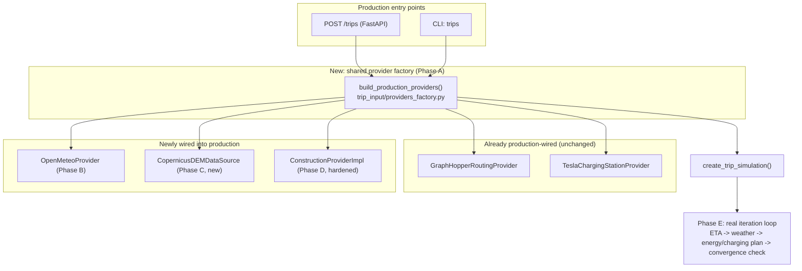

# Plan 10: Provider Integration — Wiring Weather, Construction, and Elevation into Production

---

## 0. Language Convention for This Plan

The existing codebase (AGENTS.md, all `docs/*.md`, all identifiers, comments, and docstrings) is currently written entirely in German. Per explicit direction, **this plan and all code it specifies are written in English**, with the following bounded scope (a full repository-wide translation was explicitly considered and declined in favor of this narrower scope):

- Every **new** file, function, class, and variable this plan introduces is named and documented in English.
- Every **existing** private helper function, local variable, and docstring inside a function this plan's phases modify is renamed/translated to English as part of that modification. Section 4 gives the complete rename table.
- **Public cross-module Pydantic model fields defined in files this plan does not otherwise touch** (`trip_input/models.py::TripRequest/Waypoint/VehicleProfile`, `energy/models.py`, `construction/models.py::ConstructionZone/Sperrungstyp/Land/ConstructionProvider`, `weather/models.py::WeatherSample/WeatherQuery`, `elevation/models.py::SegmentGradient/ElevationPoint`, `routing/models.py::RouteSegment/Route/FaehrSegment`, `simulation/models.py::LadehaltDetour`, `optimization/models.py`) **remain German for now**. Renaming them would cascade into `energy.py`, `parser.py`, `optimizer.py`, and dozens of test files that are entirely outside this plan's scope (provider wiring, not a codebase-wide rename). Wherever this plan's new/renamed English local variables must be passed as keyword arguments into one of these untouched functions (e.g. `calculate_segment_consumption(wetter=weather_sample, ...)`), the call site necessarily keeps the existing German keyword name — this is called out explicitly at every occurrence below, not silently glossed over.
- Quoted evidence from the *current* codebase (Section 2) is quoted verbatim in its original German, with an English translation alongside, since that is what the file actually contains today — pretending otherwise would misrepresent the audit.

---

## 1. Purpose & Scope

This plan is the result of an audit of the contextual data sources that, per `docs/02-architektur.md` and `docs/03-modulspezifikationen.md`, are supposed to feed into trip planning: charging infrastructure, weather (incl. wind/temperature), construction sites, and (implicitly, since it is directly energy-relevant) elevation/grade. For each source we checked: (a) does a real, network-capable provider exist, and (b) is it actually used by the production pipeline (`POST /trips`, CLI `trips`), as opposed to only in the module's own tests.

**Core finding:** Of the five data sources, only **one** (`charging_infrastructure`) is actually wired end-to-end into production. `routing` (GraphHopper) is also fully wired, but it supplies geometry only, not context data. **Weather, construction, and elevation are all three already implemented as real, network-/data-capable providers — but none of them is ever instantiated by the production endpoint or the CLI.** The energy calculation (`energy.calculate_segment_consumption`) correctly consumes every one of these inputs; the problem is entirely in the orchestration layer (`trip_input/api.py`, `trip_input/cli.py`), which never gives the real providers a chance because it (1) is type-restricted to the Fake classes, (2) never imports the real classes, and (3) in two places overwrites intermediate results with hardcoded placeholders.

This plan fixes that for Germany/Denmark/Sweden (DE/DK/SE) — the project's geographic focus.

**Explicit non-goals** (already decided in `docs/06-offene-punkte-widersprueche.md`): energy-optimal rerouting (the road route stays fixed after GraphHopper), Tesla Supercharger crawler extensions (already solved separately in Plan 09), live traffic data, per-source uncertainty modeling.

---

## 2. Audit Findings (Current State)

### 2.1 Wiring Matrix

| Data source | Real provider implemented? | Wired into `/trips` (FastAPI)? | Wired into CLI `trips`? | DE/DK/SE coverage |
|---|---|---|---|---|
| `routing` (GraphHopper) | ✅ yes | ✅ yes (`get_routing_provider`) | ❌ no (Fake) | ✅ real OSM extract `data/de-dk-se.osm.pbf` |
| `charging_infrastructure` (Tesla) | ✅ yes (SQLite) | ✅ yes (`get_charging_provider`) | ❌ no (Fake) | ✅ DE 427 / DK 51 / SE 155 stations in `data/tesla_superchargers.db` |
| `weather` (Open-Meteo) | ✅ yes (`OpenMeteoProvider`) | ❌ no — only `FakeWeatherProvider` | ❌ no | n/a (Open-Meteo is global, no country filter needed) |
| `wind` (pure calculation) | ✅ yes | ✅ yes (`compute_wind_components_for_route`) | ✅ yes (computed on Fake weather) | n/a |
| `construction` (DATEX II) | ✅ yes (`ConstructionProviderImpl`), but with real implementation defects (Section 2.3) | ❌ no — default returns `[]` | ❌ no | ⚠️ DE/DK client exists but sends no auth; SE requires a mandatory `tv_api_key` field, and its endpoint/protocol are wrong |
| Elevation/grade (`elevation`) | ❌ no — only `FakeDataSource` | ❌ no, result is discarded | ❌ no | n/a — hardcoded `steigung_prozent=0.0` everywhere |

### 2.2 Evidence — Weather

- `src/tripplanner/weather/client.py`: `OpenMeteoClient` — a real `httpx` request against `https://api.open-meteo.com/v1/forecast`, not a stub.
- `src/tripplanner/weather/providers.py:147` `OpenMeteoProvider` (with cache), `:214` `refetch_weather` (re-queries already-cached points with an updated timestamp — exactly the "Besonderheit" required by `03-modulspezifikationen.md` §3).
- `src/tripplanner/trip_input/api.py:59`: `from tripplanner.weather import FakeWeatherProvider` — **`OpenMeteoProvider` is never imported anywhere in `api.py`.**
- `src/tripplanner/trip_input/api.py:604`: `weather_provider: FakeWeatherProvider | None = None` — the parameter type is the concrete Fake class, not the `WeatherProvider` protocol. A caller trying to pass `OpenMeteoProvider` would be rejected by `mypy --strict`.
- `src/tripplanner/trip_input/api.py:150-161` (`_step_5_wetterabfrage`): `if provider is None: provider = FakeWeatherProvider()`.
- `src/tripplanner/trip_input/api.py:1150-1156` (`create_trip_endpoint`): the `Depends` list only contains `routing_provider`, `charging_provider` — there is no `weather_provider` parameter on the endpoint at all.
- **Consequence:** every production `/trips` request gets identical synthetic weather for every segment from `FakeWeatherProvider`, regardless of the actual place/time in DE/DK/SE.

### 2.3 Evidence — Construction

- `src/tripplanner/construction/providers.py:32-36`:

  ```python
  DATEXII_ENDPOINTS: dict[Land, str] = {
      Land.DE: "https://www.mobilithek.info/datexii/rest/v2/situations",
      Land.DK: "https://businessservice.dataudveksler.app.vd.dk/api/DateX2",
      Land.SE: "https://api.trafikinfo.trafikverket.se/v1/trafficincidents",
  }
  ```

  Real endpoints exist. Auth mechanisms were verified against real protocol documentation (not guessed) and against `credentials.local.yaml`, which the user provided with fields `DE: {user, pass}`, `DK: {clientid, secret}`, `SE: {key}`:
  - **DK (Vejdirektoratet/Dataudveksleren), resolved — no OAuth2 flow needed:** confirmed via the official "TRACÉ Protokolbeskrivelse Datex II 3.2, REST til Dataudveksleren" (`api.vejdirektoratet.dk`): the REST endpoint is a single `GET` secured with **HTTP Basic Authentication**: `Authorization: Basic base64(username:password)`. "username und password konfigureres i DU vid opsætning af datasæt" — i.e. the DU portal's service-account "Client ID"/"Secret" pair *is* the username/password pair for Basic Auth, not an OAuth2 client-credentials pair. So `DK.clientid` → Basic Auth username, `DK.secret` → Basic Auth password, sent directly on every request. No separate token endpoint, no client_id in the request body. `dk_service_account`/`dk_api_key` (`providers.py:44-45`) are declared but **never used** in `_build_dk_params` (`providers.py:135-142`) — rename them to `dk_client_id`/`dk_secret` to match the real semantics.
  - **DE — superseded per direct user instruction: use the Autobahn GmbH open API instead of Mobilithek.** `mobilithek.info`/DATEX-II is dropped entirely for DE. `https://verkehr.autobahn.de/o/autobahn` (documented at `autobahn.api.bund.dev`, OpenAPI spec at `autobahn.api.bund.dev/openapi.yaml`) is a public, **unauthenticated** JSON REST API operated by Die Autobahn GmbH des Bundes. Verified live: `GET https://verkehr.autobahn.de/o/autobahn/A1/services/roadworks` returns real, current roadwork entries with `coordinate: {lat, long}`, a `geometry` (GeoJSON `LineString`), `impact.symbols` (lane-closure indicators such as `CLOSED`/`SEPARATE`/`ARROW_DOWN`), `display_type` (`SHORT_TERM_ROADWORKS`/`ROADWORKS`), an optional `startTimestamp`, and free-text `description` (no structured German speed-limit field). The API is fetched **per Autobahn number** (`roadId` path parameter, e.g. `A1`), not per bounding box, and returns JSON, not DATEX-II XML — this is architecturally different from the DK/SE integration and needs its own fetch + parse path (Section 8 below), not the shared `parse_datexii_xml`. `mdm_username`/`mdm_password`/the whole OAuth2/X.509 discussion for DE is now moot and removed from this plan.
  - **SE (Trafikverket), resolved:** `tv_api_key: str` (`providers.py:46`) is a **required field with no default** — constructing `ConstructionProviderConfig()` without a key already raises a `ValidationError`. In addition, the endpoint is wrong: Trafikverket's real Open API is `https://api.trafikinfo.trafikverket.se/v2/data.json` (not `v1/trafficincidents`), expects a **POST with an XML body** (`<REQUEST><LOGIN authenticationkey="..."/><QUERY objecttype="Situation" ...>...</QUERY></REQUEST>`) with `SE.key` from `credentials.local.yaml` as the `authenticationkey` attribute — not the `GET`-with-query-string request currently built (`_build_se_params`, `providers.py:144-150`, which despite the comment "Trafikverket Open API nutzt JSON POST" ("Trafikverket's open API uses JSON POST") is actually dispatched via `self._client.get(...)` at `providers.py:102` — **the comment and the code contradict each other**).
- `src/tripplanner/trip_input/api.py:34`: `from tripplanner.construction.providers import FakeConstructionProvider` — **`ConstructionProviderImpl` is never imported anywhere in `api.py`.**
- `src/tripplanner/trip_input/api.py:605`: `construction_provider: FakeConstructionProvider | None = None` — same type problem as weather.
- `src/tripplanner/trip_input/api.py:177-192` (`_step_6_construction_sites`): `if construction_provider is None: return []` — not even a Fake is used as default; an empty list is returned immediately.
- `src/tripplanner/trip_input/api.py:679`: `baustellen = await _step_6_construction_sites(construction_provider, route, ["DE", "DK", "SE"])` — the country filter is correctly scoped to the project's focus countries, but never actually applies because `construction_provider` is always `None` in production.
- **What already works:** `energy.py:13,63,94-100` imports `ConstructionZone` and correctly applies `tempolimit_kmh`/`tempolimit_override` to the segment speed via `min()`; per architecture decision 2 in `06-offene-punkte-widersprueche.md`, `optimization/` doesn't need construction awareness since there is no rerouting. So the consumption path is correct — only the data source never delivers real data in production.

### 2.4 Evidence — Elevation/Grade

- `src/tripplanner/elevation/providers.py` contains only `DEMDataSourceProtocol` (a Protocol) and `FakeDataSource` (synthetic noise values). **Not a single line anywhere in the `elevation` module imports `rasterio` or reads a real DEM tile.** `docs/plans/02-elevation.md:24` explicitly names tile download as "out of scope … an upstream data pipeline" — that upstream pipeline was never built.
- The `data/` directory contains no DEM data (`data/tiles/basemap.pmtiles` is exclusively frontend map rendering, not elevation data).
- `src/tripplanner/trip_input/api.py:99-110` (`_step_2_hoehenprofil_extractieren`): constructs `ElevationProvider(data_source=FakeDataSource())` **internally, hardcoded** — it doesn't even accept a provider parameter.
- `src/tripplanner/trip_input/api.py:602-603,656`: `create_trip_simulation` does have an `elevation_provider` parameter, but calls `_step_2_hoehenprofil_extractieren` with only `route` (`_ = _step_2_hoehenprofil_extractieren(route)`) — **the parameter is dead code**, and the result is discarded via `_ =`.
- `src/tripplanner/trip_input/api.py:229-238` and `:345-351` (two locations): instead of using the (discarded) elevation profile, every segment gets a hardcoded `SegmentGradient(steigung_prozent=0.0, hoehendifferenz_m=0.0, …)` with the comment `# Vereinfachung: flach` ("simplification: flat").
- **Consequence:** the physically correct grade calculation in `energy.py:111,133,137,162-163` (grade force, regeneration on downhill) never receives real data — every trip is treated energetically as if it were completely flat. This particularly affects elevation profiles in southern Germany/low mountain ranges and parts of southern Sweden.

### 2.5 Evidence — Iterative ETA/Weather Convergence (`docs/02-architektur.md`)

- `src/tripplanner/weather/weather.py:51-126` (`fetch_weather_iterative`): the structure exists (loop, `max_iterations`, `convergence_threshold_s`), but line 98 simulates deviations with `if hash(sample.koordinate) % 3 == 0` instead of deriving a real ETA from an actual energy/charging-plan recalculation. The comment on lines 90-91 confirms this explicitly: "Simuliere Berechnung einer neuen ETA (in echter Implementierung: Energieverbrauch + Ladeplan berechnen)" ("Simulates computing a new ETA — in a real implementation: compute energy consumption + charging plan").
- This function has **zero callers outside `tests/weather/`**.
- `src/tripplanner/simulation/simulate.py:118-119,130`: `simulate_trip` accepts `max_iterations` and `convergence_threshold_minutes`; the docstring marks both explicitly "(nicht verwendet)" ("unused"); the `weather_samples` parameter carries the same annotation.
- `src/tripplanner/trip_input/api.py:371-404` (`_step_9_eta_aktualisieren`): a single, fixed ETA update after the charging-plan calculation — no feedback loop back to step 5 (weather query), no convergence check, no retry.
- **Consequence:** the "iterative time/weather resolution" described in `docs/02-architektur.md` to resolve the ETA ↔ weather ↔ energy/charging-plan circularity exists only as documentation and as an isolated, non-integrated stub function.

---

## 3. Target Architecture



Guiding principle: **one provider, one construction site.** Today provider construction isn't duplicated anywhere (the CLI doesn't build any real providers at all), but the fix must not introduce duplication either — `_lifespan` (FastAPI) and the CLI `trips` command must call the same factory function, configured exclusively via environment variables (the existing convention for `GRAPHHOPPER_URL`, see `api.py:73,76,766`, already does this).

---

## 4. Identifier Rename Table

Applied by the phase noted in the "Phase" column, in the file noted. Names not listed (e.g. `Route`, `RouteSegment`, `WeatherSample`, `ConstructionZone`, `Sperrungstyp`, `Land`, `SegmentGradient`, `TripRequest`, `Waypoint`, `VehicleProfile`, `LadehaltDetour`) are Pydantic model fields/types defined in files this plan does not modify and are **out of scope** — they keep their current German names and are referenced as-is from the renamed code below.

| File | Old (German) | New (English) | Phase |
|---|---|---|---|
| `trip_input/api.py` | `_step_2_hoehenprofil_extractieren` | `_step_2_extract_elevation_profile` | C |
| `trip_input/api.py` | `_step_3_segmentierung` | `_step_3_segment_route` | A |
| `trip_input/api.py` | `_step_4_initiale_eta_schaetzen` | `_step_4_estimate_initial_eta` | A |
| `trip_input/api.py` | `_step_5_wetterabfrage` | `_step_5_fetch_weather` | B |
| `trip_input/api.py` | `_step_7_energieverbrauch_segment` | `_step_7_calculate_segment_energy` | C |
| `trip_input/api.py` | `_step_8_ladeplan_optimieren` | `_step_8_optimize_charging_plan` | C |
| `trip_input/api.py` | `_step_9_eta_aktualisieren` | `_step_9_update_eta` | E |
| `trip_input/api.py` | `_step_lade_detours_routen` | `_step_route_charging_detours` | A |
| `trip_input/api.py` | `_finde_klammerpunkte` | `_find_bracket_points` | A |
| `trip_input/api.py` | `_segment_index_fuer_koordinate` | `_segment_index_for_coordinate` | A |
| `trip_input/api.py` | `_mit_abgeleiteter_wartezeit` | `_with_derived_wait_time` | A |
| `trip_input/api.py` | `_bbox_mitte` | `_bbox_center` | A |
| `trip_input/api.py` | `_matche_faehr_zeitfenster` | `_match_ferry_time_window` | A |
| `trip_input/api.py` (`create_trip_simulation` param) | `anfrage_dict` | `request_dict` | A |
| `trip_input/api.py` (`create_trip_simulation` param) | `ziel_soc_pct` | `destination_soc_pct` | A |
| `trip_input/api.py` (local var) | `anfrage` | `request` (a `TripRequest` instance — attribute access stays e.g. `request.abfahrtszeit`, `request.zwischenstopps`, since `TripRequest`'s fields are untouched) | A |
| `trip_input/api.py` (local var) | `erkannte_faehren` | `detected_ferries` | A |
| `trip_input/api.py` (local var) | `segmente` | `segments` | A |
| `trip_input/api.py` (local var) | `segment_eta_liste` | `segment_eta_list` | A |
| `trip_input/api.py` (local var) | `zwischenstopps_mit_wartezeit` | `waypoints_with_wait_time` | A |
| `trip_input/api.py` (local var) | `wetter_samples` | `weather_samples` | A |
| `trip_input/api.py` (local var) | `baustellen` | `construction_zones` | A |
| `trip_input/api.py` (local var) | `energie_ergebnisse` | `energy_results` | A |
| `trip_input/api.py` (local var) | `faehr_pins` | `ferry_pins` | A |
| `trip_input/api.py` (local var) | `ladedauer_map` | `charging_duration_map` | A |
| `trip_input/api.py` (local var) | `ladeplan` | `charging_plan` | A |
| `trip_input/api.py` (local var) | `ladehalt_detouren` | `charging_stop_detours` | A |
| `trip_input/api.py` (local var) | `simulationsergebnis` | `simulation_result` | A |
| `trip_input/api.py` (`_step_6_construction_sites` param) | `laender` | `countries` | A |
| `trip_input/api.py` (local var) | `laender_enum` | `countries_enum` | A |
| `construction/providers.py` | `_map_sperrungstyp` | `_map_closure_type` (still returns the untouched `Sperrungstyp` enum) | D |
| `construction/providers.py` (`ConstructionProviderImpl.fetch_construction_zones` param) | `laender` | `countries` (positional call site in `api.py`, safe to diverge from the `ConstructionProvider` Protocol's own untouched parameter name) | D |
| `construction/providers.py` (`_fetch_landscape_zones` param) | `land` | kept — already English-adjacent (this is the untouched `Land` enum's variable, not a German word) | — |
| `simulation/simulate.py` (param) | `ladehalt_detouren` | `charging_stop_detours` | E |
| `simulation/simulate.py` (params) | `weather_samples`, `max_iterations`, `convergence_threshold_minutes` | **removed** (dead parameters, see Phase E) | E |
| `trip_input/cli.py` (CLI option) | `--ziel` | `--destination` | A |
| `trip_input/cli.py` (CLI option) | `--zwischenstopps` | `--waypoints` | A |
| `trip_input/cli.py` (CLI option) | `--ziel-soc-pct` | `--destination-soc-pct` | A |
| `trip_input/cli.py` (param) | `ziel`, `ziel_coord` | `destination`, `destination_coord` | A |
| `trip_input/cli.py` (param) | `zwischenstopps` | `waypoint_args` | A |
| `trip_input/cli.py` (param) | `abfahrtszeit` | `departure_time` | A |
| `trip_input/cli.py` (local var) | `departuretime_dt` | `departure_time_dt` | A |
| `trip_input/cli.py` (local var) | `between`, `wp`, `dur` | `waypoints`, `waypoint_arg`, `duration` | A |

**Important boundary case:** in `cli.py`'s `trips` command, the request dict built for `create_trip_simulation` (currently named `request`) contains **literal string keys** (`"ziel"`, `"zwischenstopps"`, `"abfahrtszeit"`, `"fahrzeugprofil"`, `"praeferenzen"`) that are passed to `TripRequest.model_validate(request_dict)`. Those keys **must stay exactly as they are today**, because they are field names of `TripRequest`, defined in `trip_input/models.py`, which this plan does not modify. Renaming the *Python variables* that feed those keys (per the table above) is safe; renaming the *dict keys themselves* would break `model_validate` and is explicitly **not** part of this plan.

---

## 5. Phase A: Shared Provider Factory, Protocol Typing, and Orchestration Renames

**Goal:** Establish type safety and a single place where production providers are built — a prerequisite for Phases B–D, which would otherwise duplicate wiring code across `api.py` *and* `cli.py`. This phase also applies the Section 4 renames to `create_trip_simulation`'s overall structure and its helper functions, since every later phase (B–E) continues to edit this same function and its callees, and doing the rename once up front avoids re-touching already-renamed code repeatedly.

**Files:**

- Modify: `src/tripplanner/trip_input/api.py:604-605` — change parameter types from `FakeWeatherProvider | None` / `FakeConstructionProvider | None` to the protocols `WeatherProvider | None` (`tripplanner.weather.providers.WeatherProvider`) / `ConstructionProvider | None` (`tripplanner.construction.models.ConstructionProvider`). Extend the import lines (34, 59) accordingly (import the protocol in addition; keep the Fake import for the in-module test-friendly defaults).
- Modify: `src/tripplanner/trip_input/api.py` — apply every Phase-A row from the Section 4 rename table (all `_step_*`/helper function names, `create_trip_simulation`'s local variables, its `anfrage_dict`/`ziel_soc_pct` parameters, and `_step_6_construction_sites`'s `laender`/`laender_enum`). Translate each renamed function's docstring to English while renaming it.
- New: `src/tripplanner/trip_input/providers_factory.py` — contains `build_production_providers() -> ProductionProviders` (a small `NamedTuple`/`dataclass` with `routing`, `elevation_provider`, `weather`, `construction`, `charging`) and `close_production_providers(providers)` for clean shutdown (closing HTTP clients). Reads configuration exclusively from environment variables, with the same defaults used today (`GRAPHHOPPER_URL`; new: `OPEN_METEO_BASE_URL` optional, `TESLA_SUPERCHARGER_DB_PATH` optional, `MDM_USERNAME`/`MDM_PASSWORD`/`DK_SERVICE_ACCOUNT`/`DK_API_KEY`/`TV_API_KEY`).
- Modify: `src/tripplanner/trip_input/api.py:756-778` (`_lifespan`) — calls `build_production_providers()` once, stores the result on `app.state`; add `get_weather_provider`/`get_construction_provider`/`get_elevation_provider` as new `Depends` functions, mirroring `get_routing_provider`/`get_charging_provider` (lines 783-809).
- Modify: `src/tripplanner/trip_input/cli.py:61-166` — apply the Section 4 CLI renames (`--ziel`→`--destination`, etc.); the `trips` command calls `build_production_providers()` and passes all five providers to `create_trip_simulation(...)`, instead of passing none. Add a new `--offline` CLI flag (default `False`) that instead explicitly uses all Fakes — for development/CI without network access, so the AGENTS.md requirement "no live calls in unit tests" stays satisfiable for `test_cli.py` (tests call `trips(..., offline=True)` or mock `build_production_providers`).

**Interfaces (binding for Phases B–D):**

```python
# trip_input/providers_factory.py
class ProductionProviders(NamedTuple):
    routing: RoutingProvider
    elevation_provider: (
        ElevationProvider  # tripplanner.elevation.ElevationProvider, with a real data_source
    )
    weather: WeatherProvider
    construction: ConstructionProvider
    charging: ChargingStationProvider


def build_production_providers() -> ProductionProviders: ...
async def close_production_providers(providers: ProductionProviders) -> None: ...
```

**Acceptance criterion:** `uv run mypy --strict src/tripplanner/trip_input/` stays green with the new protocol types; a new test `tests/trip_input/test_providers_factory.py` verifies that `build_production_providers()` returns a usable tuple even when optional env vars are missing (in Phase D, construction returns empty lists rather than crashing for countries without credentials — see Section 7).

---

## 6. Phase B: Wire Weather (Open-Meteo)

**Goal:** `OpenMeteoProvider` replaces `FakeWeatherProvider` as the production default, without breaking Fake usage in existing unit tests (tests keep instantiating `_step_5_fetch_weather`/`create_trip_simulation` explicitly with `FakeWeatherProvider()`).

**Files:**

- Modify: `src/tripplanner/trip_input/providers_factory.py` (from Phase A) — `build_production_providers()` constructs `OpenMeteoProvider()` (the default constructor is sufficient; `client.py` needs no API key).
- Modify: `src/tripplanner/trip_input/api.py:150-161` (`_step_5_fetch_weather`, renamed in Phase A) — the parameter type is already corrected to `WeatherProvider | None` by Phase A; the `None` fallback stays `FakeWeatherProvider()` (test convenience), but production code now always passes a concrete instance.
- Modify: `src/tripplanner/trip_input/api.py:1149-1156` (`create_trip_endpoint`) — new parameter `weather_provider: WeatherProvider = Depends(get_weather_provider)`, forwarded to `create_trip_simulation(..., weather_provider=weather_provider, ...)`.
- Modify: `_lifespan` (`api.py:756-778`) — `OpenMeteoProvider` (via its `OpenMeteoClient`) must call `await ....weather.close()` on shutdown (see `providers.py:255-257`), mirroring the existing `graphhopper_client.close()`.

**Important — rate limits/error handling:** Open-Meteo's free tier is limited to roughly 10,000 calls/day; `OpenMeteoProvider` already batches through `OpenMeteoClient.fetch_forecast` (multiple coordinates per call, see `client.py`). For production, add: map `httpx.HTTPStatusError` on 429 in the endpoint (`api.py`, the `except` chain from line 1275) to HTTP 502, mirroring the existing GraphHopper error path (`api.py:1280-1284`), instead of falling through to a generic 500.

**Test strategy:** New test `tests/trip_input/test_api.py::test_create_trip_endpoint_uses_open_meteo_provider` mocks `httpx.AsyncClient.get` (no live call, per AGENTS.md) and verifies that `_step_7_calculate_segment_energy` (renamed in Phase C) is called with values extracted from the Open-Meteo response rather than the Fake constants.

**Acceptance criterion:** A manual test run via `./run.sh start backend` + `curl -X POST localhost:8000/trips ...` for a route in DE/DK/SE returns different `temperatur_c`/`windgeschwindigkeit_ms` values depending on time of day/season (verifiable via `--verbose` logging or a debug endpoint that returns `weather_samples`).

---

## 7. Phase C: Implement and Wire Elevation (Copernicus DEM)

**Goal:** The largest single piece of work in this plan, but also the largest accuracy gain — real grade data instead of hardcoded flat. The original assumption in `docs/plans/02-elevation.md:652` (20-30 GB download for DE/DK/SE) is **outdated**: Copernicus DEM GLO-30 sits in the public AWS Open Data bucket `copernicus-dem-30m` as Cloud-Optimized GeoTIFF and is directly readable via GDAL VSI (`/vsicurl/` or `/vsis3/`, no AWS credentials needed for the public bucket) using HTTP range requests — **nothing needs to be downloaded**; `rasterio` only fetches the tile windows actually needed per route.

**Files:**

- Extend: `src/tripplanner/elevation/providers.py` with `CopernicusDEMDataSource` (implements `DEMDataSourceProtocol`, `providers.py:16-72`):

  ```python
  class CopernicusDEMDataSource:
      """Reads Copernicus DEM GLO-30 directly from the public AWS Open Data
      bucket via GDAL /vsicurl/ (COG range reads, no local bulk download)."""

      _BUCKET_BASE = "vsicurl/https://copernicus-dem-30m.s3.amazonaws.com"

      def __init__(self, cache_dir: Path | None = None) -> None:
          # cache_dir: optional local disk cache for open rasterio datasets
          # (LRU over the few most recently used tiles, see Task C.2)
          ...

      def _tile_path(self, lat: float, lon: float) -> str:
          # Copernicus_DSM_COG_30_{NS}{lat:02d}_00_{EW}{lon:03d}_00_DEM/
          # Copernicus_DSM_COG_30_{NS}{lat:02d}_00_{EW}{lon:03d}_00_DEM.tif
          ...

      def get_elevation(self, lat: float, lon: float) -> float: ...
      def get_elevations_batch(self, coordinates: list[tuple[float, float]]) -> list[float]: ...
      def get_tile_at(self, lat: float, lon: float) -> DEMTile | None: ...
      def get_tiles_in_bbox(self, min_lat, max_lat, min_lon, max_lon) -> list[DEMTile]: ...
  ```

  The tile naming scheme must be verified against 2-3 real tile paths in the `copernicus-dem-30m` bucket listing before implementation (e.g. `N52`/`E013` for Berlin, `N55`/`E012` for Copenhagen, `N59`/`E018` for Stockholm) — **do not implement from memory**; cross-check via `aws s3 ls --no-sign-request s3://copernicus-dem-30m/ | grep N52_00_E013` (or the HTTPS listing), since the AWS Registry of Open Data listing documents the exact folder/file naming convention.
- Modify: `src/tripplanner/elevation/elevation.py:92-143` (`calculate_segment_gradients`) — no change needed, the function is already provider-agnostic (it takes `elevation_points`, not the data-source type).
- Modify: `src/tripplanner/trip_input/providers_factory.py` — `build_production_providers()` constructs `ElevationProvider(data_source=CopernicusDEMDataSource(cache_dir=...))`.
- Modify: `src/tripplanner/trip_input/api.py:99-110` (`_step_2_extract_elevation_profile`, renamed in this phase) — extend the signature with `elevation_provider: ElevationProvider` (no more internal default; the caller in `create_trip_simulation` supplies it); fall back to a Fake only when `create_trip_simulation`'s own `elevation_provider` parameter is `None`.
- Modify: `src/tripplanner/trip_input/api.py:655-656` — `elevation_points = _step_2_extract_elevation_profile(route, elevation_provider)` (stop discarding the result).
- Modify: `src/tripplanner/trip_input/api.py:229-238` and `:345-351` (**both** locations, inside `_step_7_calculate_segment_energy` and `_step_8_optimize_charging_plan` respectively, both renamed in this phase) — replace the hardcoded `steigung_prozent=0.0` list with a real call:

  ```python
  gradients = elevation_provider.calculate_segment_gradients(elevation_points, route)
  ```

  (`ElevationProvider.calculate_segment_gradients` already exists, `elevation.py:92-143`, and is already built for exactly this call pattern — it is simply never invoked today.)
- New: `tests/fixtures/elevation/` — a small synthetic COG test tile (the directory listing shows `scripts/create_test_dem_tile.py` already exists — reuse it instead of building a new tile generator) for integration tests without live S3 access.

**Error handling:** if a coordinate falls outside available tiles (e.g. over water/ferry) or the S3 range request fails (network outage), `get_elevation` must fall back to `0.0` (already required by `docs/plans/02-elevation.md` §1, "sea areas → 0 m") instead of raising — otherwise `/trips` would crash on every ferry route.

**Test strategy:** extend `tests/elevation/test_providers.py` with `CopernicusDEMDataSource` tests against the local test-tile fixture (no live S3 call — `rasterio.open` on a local path instead of `/vsicurl/`, injectable via the base path). An `@pytest.mark.integration` test verifies real `/vsicurl/` access against the real bucket for a known point (e.g. the Zugspitze, expected elevation ~2960 m as a regression value).

**Acceptance criterion:** for a test route with a known elevation difference (e.g. Munich–Garmisch-Partenkirchen, ~+500 m), `SegmentEnergyResult` shows noticeably higher consumption on the uphill segments than on flat ground — verifiable via a regression test comparing `energie_kwh` between an artificially flattened and the real grade.

---

## 8. Phase D: Harden and Wire Construction (Autobahn GmbH DE, DATEX II DK/SE)

**Goal:** Make `ConstructionProviderImpl` production-ready for DE/DK/SE. **DE now uses the Autobahn GmbH open API** (`verkehr.autobahn.de`, no authentication) instead of Mobilithek/DATEX-II, per direct user instruction — this fully unblocks DE, in addition to the already-unblocked DK/SE. After this phase, **all three countries are live-capable with the credentials already on hand** (DK/SE from `credentials.local.yaml`, DE needs no credentials at all).

**Files:**

- Modify: `src/tripplanner/construction/providers.py:39-47` (`ConstructionProviderConfig`) — remove `mdm_username`/`mdm_password` entirely (unused, and DE no longer needs any credential field); change `tv_api_key: str` to `tv_api_key: str | None = None`; rename `dk_service_account`/`dk_api_key` → `dk_client_id`/`dk_secret` (Basic Auth semantics, confirmed real). `ConstructionProviderImpl` must no longer fail at object construction time when only some countries are configured.
- Modify: `src/tripplanner/construction/providers.py:79-83` (`fetch_construction_zones`) — per country, check whether the necessary credentials are present (`_has_credentials(country) -> bool`; DK requires `dk_client_id` and `dk_secret`, SE requires `tv_api_key`; DE has no credential requirement — always attempted); if a DK/SE credential is missing, skip that country (empty list for that country, `logger.warning` instead of silently swallowing it) instead of sending a request without auth that would fail with 401/403 anyway.
- Modify: `src/tripplanner/construction/providers.py:32-36` (`DATEXII_ENDPOINTS`) — remove the `Land.DE` entry entirely; DE is no longer a DATEX-II country. Add `AUTOBAHN_BASE_URL = "https://verkehr.autobahn.de/o/autobahn"` as a separate module-level constant (per the OpenAPI spec at `autobahn.api.bund.dev/openapi.yaml`).
- New: `_fetch_de_roadworks(self, route: routing_models.Route) -> list[ConstructionZone]` in `construction/providers.py` — a DE-specific fetch+parse path, parallel to (not reusing) `_fetch_landscape_zones`'s DATEX-II path, since the Autobahn API is JSON, per-road, and unauthenticated:
  1. `_extract_autobahn_ids(route) -> set[str]`: scan `route.segments` for `strassenklasse == "MOTORWAY"` and extract an Autobahn ID (`A\d+`) from `segment.strassenname` via regex; segments with no resolvable Autobahn ID are skipped (a documented, safe under-approximation — GraphHopper does not always populate `street_name` for motorways with the route number).
  2. For each distinct Autobahn ID, `GET {AUTOBAHN_BASE_URL}/{autobahn_id}/services/roadworks` (no auth headers, no query params) — issue these concurrently (`asyncio.gather`) since each call is a separate, small JSON payload, mirroring the existing per-country concurrency pattern in `fetch_construction_zones`.
  3. `_parse_autobahn_roadwork(entry: dict, route) -> ConstructionZone | None`: map each JSON `roadworks[]` entry to a `ConstructionZone`:
     - `betroffene_segmente`: match `entry["coordinate"]` (and optionally sample points along `entry["geometry"]["coordinates"]`) to the nearest route segment(s) via the existing `_segment_index_for_coordinate`-style haversine matching (reuse the helper renamed in Phase A instead of duplicating it); entries whose nearest segment is farther than a small corridor threshold (e.g. 500 m) are discarded as not actually on this route.
     - `sperrungstyp`: `Sperrungstyp.PARTIALLY_CLOSED` if `"CLOSED"` appears in `entry["impact"]["symbols"]`, else `Sperrungstyp.TEMPORARY_SPEED_LIMIT` — documented assumption per AGENTS.md ("bei Unsicherheit... eine begründete, dokumentierte Annahme"): the Autobahn API does not expose a structured speed-limit field, and a generic reduced-speed assumption for active roadworks without an explicit closure is the standard real-world default for German Autobahn construction zones.
     - `tempolimit_kmh`: `None` if `sperrungstyp == PARTIALLY_CLOSED` is not required by the model validator; when `sperrungstyp == TEMPORARY_SPEED_LIMIT` (the required-tempolimit case), default to `80` (the standard German Autobahn roadworks speed limit absent more specific data) — document this constant with a comment citing this assumption.
     - `gueltig_von`: `entry["startTimestamp"]` parsed as ISO 8601 if present, else the fetch time (`datetime.now(UTC)`) as a conservative "currently valid" fallback.
     - `gueltig_bis`: `None` (API gives no reliable end date across all entry shapes — some only describe recurring daily windows in free-text `description`).
     - `land`: `Land.DE`.
     - `umleitungshinweis`: `None` (no structured detour field; the free-text `description` list is route-guidance prose, not a usable single string without further NLP — out of scope).
  4. `fetch_construction_zones` dispatches to `_fetch_de_roadworks` for `Land.DE` (no credential check needed — the API takes none) and to the existing DATEX-II path for `Land.DK`/`Land.SE`.
- Modify: `src/tripplanner/construction/providers.py:135-142` (`_build_dk_params`) — remove query-parameter credential handling; instead, `_fetch_landscape_zones`'s DK request must be sent with `auth=httpx.BasicAuth(config.dk_client_id, config.dk_secret)` (standard HTTP Basic Authentication, confirmed via the official Vejdirektoratet "TRACÉ Protokolbeskrivelse ... REST til Dataudveksleren" spec — no separate token endpoint).

  ```python
  def _build_se_request_xml(self, route: routing_models.Route) -> str:
      bbox = self._route_to_bounding_box(route)
      return (
          "<REQUEST>"
          f'<LOGIN authenticationkey="{self._config.tv_api_key}"/>'
          '<QUERY objecttype="Situation" schemaversion="1.5">'
          f'<FILTER><WITHIN name="Deviation.GeometryWkt" shape="box" value="{bbox}"/></FILTER>'
          "</QUERY></REQUEST>"
      )
  ```

  The exact `objecttype`/filter schema (roadworks at Trafikverket typically live under `Situation`/`Deviation` with a roadwork `MessageType`) must be verified against the current Trafikverket API documentation (after registering at `trafikverket.se/e-tjanster/trafikverkets-oppna-api-for-trafikinformation/`) before implementation.
  Response parsing: `parser.py` expects DATEX-II XML — check whether `v2/data.json` needs to be requested with a matching suffix (`.xml` instead of `.json`) so that `parse_datexii_xml` (unchanged) still applies.
- Modify: `src/tripplanner/construction/providers.py:100-107` — differentiate exception handling: log `httpx.HTTPStatusError` with status 401/403 (`logger.error("Construction API %s: auth failed", country)`) instead of silently returning `[]`; timeouts/network errors stay `[]` + `logger.warning` (per architecture decision 6, construction data is only ever a "best estimate," not a hard failure condition).
- Modify: `src/tripplanner/trip_input/providers_factory.py` (from Phase A) — `build_production_providers()` loads credentials from `credentials.local.yaml` (repo root, already `.gitignore`d — verified via `git check-ignore`, matched by the existing `*.local.*` pattern) via a small `_load_local_credentials() -> dict[str, dict[str, str]]` helper (PyYAML `safe_load`, returns `{}` if the file doesn't exist — never crash when it's absent, e.g. in CI). Maps `DK.clientid`/`DK.secret` → `dk_client_id`/`dk_secret`; maps `SE.key` → `tv_api_key`. DE needs no credential mapping (the Autobahn API is unauthenticated). Environment variables (`DK_CLIENT_ID`, `DK_SECRET`, `TV_API_KEY`) take precedence over the YAML file when both are present, for deployment flexibility (env vars for containers, the YAML file for local dev). With the currently supplied `credentials.local.yaml`, this resolves DK and SE to working credentials immediately, and DE works out of the box with no configuration at all.
- Modify: `src/tripplanner/trip_input/api.py:177-192` (`_step_6_construction_sites`) — type changed from `FakeConstructionProvider | None` to `ConstructionProvider | None` (already done by Phase A); `None` behavior stays `return []` (pure test convenience, per the existing docstring comment at line 184).
- Modify: `src/tripplanner/trip_input/api.py:1149-1156` (`create_trip_endpoint`) — new `construction_provider: ConstructionProvider = Depends(get_construction_provider)` parameter, forwarded to `create_trip_simulation`.
- Apply the Phase-D rows of the Section 4 rename table (`_map_closure_type`, `countries`); additionally translate `_fetch_de_roadworks`'s docstring/comments to English as new code.
- **Important:** `ConstructionProviderImpl` is built as an `async with` context manager (`providers.py:57-64`, opens/closes the `httpx.AsyncClient`). For process-wide reuse analogous to `GraphHopperClient`/`TeslaChargingStationProvider`, either (a) remove the context-manager requirement and open the client once in `_lifespan` like the other providers, or (b) re-enter `async with` per request (simpler, but a new TCP handshake per `/trips` call). Recommendation: (a), for consistency with the rest of the codebase — `ConstructionProviderImpl.__init__` optionally accepts an already-open `AsyncClient` (the same pattern as `OpenMeteoProvider.__init__(client: OpenMeteoClient | None)`).

**Test strategy:** extend the existing `tests/construction/test_providers_impl.py` (mocks `httpx`) with test cases for (a) missing credentials → that country is skipped, not the whole request, (b) a 401 response → a logged error instead of a silent empty list, (c) SE POST body construction. No new live calls in unit tests (AGENTS.md).

**Acceptance criterion:** with env vars set, `build_production_providers().construction.fetch_construction_zones(route, [Land.DE, Land.DK, Land.SE])` for a real route returns no exception and a structurally valid (possibly empty) `list[ConstructionZone]`; without env vars set, the same call also raises no exception (graceful degradation) instead of a `ValidationError` at startup.

---

## 9. Phase E: Iterative ETA/Weather Convergence

**Goal:** Actually implement the feedback loop specified in `docs/02-architektur.md`, section "Iterative Zeit-/Wetterauflösung". This is the **architecturally most invasive** phase, since `create_trip_simulation` is currently a linear pipeline (step 4 → 5 → 6 → 7 → 8 → 9, each exactly once) and needs to become a loop over steps 4/5/7/8/9 with a termination condition.

**Prerequisite:** Phase B (real weather) must be complete — a convergence loop on `FakeWeatherProvider`'s constant values is pointless, since the values never change and every iteration converges immediately.

**Design (`create_trip_simulation`, `api.py:600-745`):**

```python
segment_eta_list = _step_4_estimate_initial_eta(route, request.abfahrtszeit)
for iteration in range(
    max_iterations
):  # default 3, configurable (constant already present in the simulate_trip call)
    weather_samples = await _step_5_fetch_weather(
        weather_provider, route, segment_eta_list, request.abfahrtszeit
    )
    construction_zones = await _step_6_construction_sites(
        construction_provider, route, ["DE", "DK", "SE"]
    )
    energy_results = await _step_7_calculate_segment_energy(
        segments, segment_eta_list, weather_samples, ...
    )
    charging_plan = await _step_8_optimize_charging_plan(route, energy_results, ...)
    new_eta_list = _step_9_update_eta(segment_eta_list, charging_plan)
    max_deviation_s = max(
        abs((new[1] - old[1]).total_seconds())
        for old, new in zip(segment_eta_list, new_eta_list, strict=True)
    )
    segment_eta_list = new_eta_list
    if max_deviation_s < convergence_threshold_minutes * 60:
        break
```

- Modify: `src/tripplanner/trip_input/api.py:661-727` — the above control flow replaces the current linear sequence. `max_iterations`/`convergence_threshold_minutes` become new parameters of `create_trip_simulation` (default 3 / 30.0, matching the defaults already present but unused in `simulate_trip`, `simulate.py:118-119`).
- Modify: `src/tripplanner/weather/providers.py` — from the second iteration onward, `_step_5_fetch_weather` should use `refetch_weather` (already implemented, `providers.py:214-253`) instead of `fetch_weather`, so unchanged points are served from cache and only points whose ETA actually shifted trigger a new Open-Meteo call.
- Delete: `src/tripplanner/weather/weather.py:51-126` (`fetch_weather_iterative`) — superseded by the real loop in `api.py`; the function with its `hash()` stub has no remaining value and shouldn't stay around looking like a working alternative (clean-cutover principle). Remove its tests in `tests/weather/test_weather.py`.
- Modify: `src/tripplanner/simulation/simulate.py:111-149` — remove the now-fully-dead `weather_samples`/`max_iterations`/`convergence_threshold_minutes` parameters (the convergence loop is now fully resolved inside `create_trip_simulation` before `simulate_trip` is ever called, so `simulate_trip` has no remaining use for them) and rename `ladehalt_detouren` → `charging_stop_detours` per Section 4 while editing that signature. Update the docstring and the call site (`api.py:730-742`) accordingly.

**Test strategy:** `tests/trip_input/test_api.py` — a new test using a `FakeWeatherProvider` that deliberately returns different values on the second query for a given point (simulating a real time-of-day shift caused by an ETA change) verifies that (a) at least two iterations run, (b) the loop terminates early on convergence, (c) `max_iterations` acts as a hard safety bound and the loop never runs unbounded.

**Acceptance criterion:** for a long trip (>500 km, multiple charging stops) with a `FakeWeatherProvider` returning time-of-day-dependent values (e.g. colder at night), `segment_eta_list` after convergence differs measurably from the initial estimate from step 4, and the remaining difference after the loop finishes is smaller than `convergence_threshold_minutes`.

---

## 10. Phase F: Integration Tests, Documentation, Regression Safety Net

- New: `tests/integration/test_trip_end_to_end.py` (`@pytest.mark.integration`) — a full `POST /trips` run against a running GraphHopper container (`./run.sh start backend`, per AGENTS.md) with a **real** `OpenMeteoProvider` (a real Open-Meteo call, permitted per AGENTS.md only in tests marked `integration`) for a Berlin → Copenhagen → Stockholm route; verifies non-null wind/temperature values, a non-flat elevation profile, and (if credentials are available in the CI environment) at least one successful construction fetch per country without an exception.
- Modify: `docs/02-architektur.md` section "Iterative Zeit-/Wetterauflösung" — add the implementation status (reference this plan, Section 9), if the document should be marked "implemented" after completion (same convention used for already-decided open questions in `07-implementierungsplan.md` §7).
- Modify: `docs/03-modulspezifikationen.md` — Module 2 (`elevation`) dependency line: add `CopernicusDEMDataSource`/AWS Open Data as the concrete realization of the previously only abstractly named "local DEM tiles."
- `uv run hk check --all` and `uv run pytest -m "not integration"` must stay green after every phase (AGENTS.md Definition of Done); re-check the 85% coverage threshold for `src/tripplanner/`, since new modules (`providers_factory.py`, `CopernicusDEMDataSource`) are added.

---

## 11. Test Strategy (Summary)

Every phase follows TDD (test before implementation, per AGENTS.md Definition of Done item 2):

| Phase | Unit tests (no live call) | Integration test (`@pytest.mark.integration`) |
|---|---|---|
| A | `test_providers_factory.py`: env-var defaults, missing config → no crash | — |
| B | `test_api.py`: mocked Open-Meteo response flows into `SegmentEnergyResult` | real Open-Meteo call for 1 coordinate |
| C | `test_providers.py`: `CopernicusDEMDataSource` against a local test COG tile | real `/vsicurl/` access, Zugspitze regression value |
| D | `test_providers_impl.py`: missing credentials, 401 handling, SE POST body shape | real DE/DK/SE calls (only if CI secrets are present, otherwise `skip`, not `xfail`) |
| E | `test_api.py`: convergence after N iterations, `max_iterations` bound | part of the E2E test from Phase F |
| F | — | `test_trip_end_to_end.py` |

---

## 12. Task Checklist

### Phase A: Provider Factory & Typing

- [x] Task A.1: Use the `WeatherProvider`/`ConstructionProvider` protocol types in `create_trip_simulation`'s signature (`api.py:604-605`)
- [x] Task A.2: Apply all Phase-A rows of the Section 4 rename table across `api.py` and `cli.py`, translating touched docstrings/comments to English
- [x] Task A.3: Create `src/tripplanner/trip_input/providers_factory.py` (`ProductionProviders`, `build_production_providers`, `close_production_providers`)
- [x] Task A.4: Switch `_lifespan` (`api.py:756-778`) to the factory; add `get_weather_provider`/`get_construction_provider`/`get_elevation_provider` dependencies
- [x] Task A.5: Switch `cli.py`'s `trips` command to the factory, add the `--offline` flag
- [x] Task A.6: Write `tests/trip_input/test_providers_factory.py`

### Phase B: Weather

- [x] Task B.1: Wire `OpenMeteoProvider` into the factory
- [x] Task B.2: Add the `weather_provider` dependency to `create_trip_endpoint`
- [x] Task B.3: Map 429/timeout errors to HTTP 502
- [x] Task B.4: Tests + manual smoke test via `./run.sh`

### Phase C: Elevation

- [x] Task C.1: Verify real Copernicus DEM tile paths against the `copernicus-dem-30m` bucket (do not guess)
- [x] Task C.2: Implement `CopernicusDEMDataSource` (including the `0.0` fallback for uncovered points)
- [x] Task C.3: Actually thread `elevation_provider` through `_step_2_extract_elevation_profile`/`create_trip_simulation` (`api.py:99-110,655-656`)
- [x] Task C.4: Replace both hardcoded `steigung_prozent=0.0` locations (`api.py:229-238`, `:345-351`) with `elevation_provider.calculate_segment_gradients(...)`
- [x] Task C.5: Tests (local test tile) + integration test (Zugspitze regression value)

### Phase D: Construction

- [x] Task D.1: Make `tv_api_key` optional; rename DK fields to `dk_client_id`/`dk_secret`; remove unused `mdm_username`/`mdm_password`; drop `Land.DE` from `DATEXII_ENDPOINTS`; add per-country credential check + skip logic (DK/SE only, DE needs none)
- [x] Task D.2: Implement `_fetch_de_roadworks`/`_extract_autobahn_ids`/`_parse_autobahn_roadwork` against the unauthenticated Autobahn GmbH API (`verkehr.autobahn.de`)
- [x] Task D.3: Wire DK HTTP Basic Auth (`httpx.BasicAuth(dk_client_id, dk_secret)`) — confirmed via the official REST protocol spec, no token endpoint
- [x] Task D.4: Fix the SE endpoint to `v2/data.json` + POST XML body with `LOGIN authenticationkey`
- [x] Task D.5: Differentiate exception handling (log auth failures instead of swallowing them)
- [x] Task D.6: Switch `ConstructionProviderImpl` from a mandatory context manager to a reusable client
- [x] Task D.7: Load `credentials.local.yaml` in `providers_factory.py` (env vars take precedence); wire `ConstructionProviderImpl` into the factory; add the dependency to `create_trip_endpoint`
- [x] Task D.8: Tests for skip-on-missing-credentials (DK/SE), auth-failure logging, SE body shape, DK Basic Auth header, DE Autobahn-ID extraction and roadwork JSON parsing (mocked HTTP, no live calls)

### Phase E: Iterative Convergence

- [x] Task E.1: Implement the loop over steps 4/5/6/7/8/9 in `create_trip_simulation`
- [x] Task E.2: Use `refetch_weather` instead of `fetch_weather` from iteration 2 onward
- [x] Task E.3: Remove the `fetch_weather_iterative` stub (including its tests)
- [x] Task E.4: Remove the dead `weather_samples`/`max_iterations`/`convergence_threshold_minutes` parameters from `simulate_trip`
- [x] Task E.5: Convergence/termination-bound tests

### Phase F: Integration & Docs

- [x] Task F.1: `tests/integration/test_trip_end_to_end.py`
- [x] Task F.2: Update status in `docs/02-architektur.md`/`docs/03-modulspezifikationen.md`
- [x] Task F.3: Final `uv run hk check --all`, `uv run pytest -m "not integration"`, coverage gate check
- [x] Task F.4: Commit per phase (AGENTS.md item 6 — no single combined commit across all phases)

---

## 13. Risks & Open Questions

1. **DE construction now fully unblocked, no external prerequisite remains.** Per direct user instruction, DE construction data comes from the Autobahn GmbH open API (`verkehr.autobahn.de`), which requires **no authentication at all** — the earlier Mobilithek/X.509-certificate blocker is moot and removed. DK and SE are likewise **fully unblocked**: DK (Vejdirektoratet) confirmed as plain HTTP Basic Auth using the already-supplied `DK.clientid`/`DK.secret`, and SE (Trafikverket) confirmed as a `LOGIN authenticationkey` XML POST using the already-supplied `SE.key`. All three countries are implementable and live-testable today with what is already on hand.
2. **Vejdirektoratet REST vs. AMQP:** resolved by direct evidence — the "TRACÉ Protokolbeskrivelse Datex II 3.2, REST til Dataudveksleren" document confirms a single `GET` over HTTPS with HTTP Basic Auth is the intended access path for this use case; the parallel AMQP push feed is a different, streaming-oriented integration this plan does not use.
3. **Copernicus DEM tile paths** must be verified against the real bucket listing before Task C.2 (Task C.1) — the naming scheme is known from public documentation, but deviations (casing, folder structure) are a known failure mode for COG datasets of this kind.
4. **Open-Meteo rate limits:** under high `/trips` load, the free Open-Meteo tier (~10,000 calls/day) could become tight, since one query is issued per segment midpoint (50+ points on long routes, potentially multiple times due to Phase-E iterations). *Mitigation:* the `refetch_weather` cache (already present) minimizes this in Phase E; at production volume, evaluate a paid Open-Meteo tier — out of this plan's scope.
5. **Phase E is the highest-risk change**, since it restructures the control flow of the central orchestration function, which is very broadly covered by `test_api.py` (65.7 KB, the largest test file in the repo). Recommendation: implement Phase E in its own feature branch with a full test run before merging, not in the same commit as B–D.
6. **CLI behavior changes visibly:** after Phases A/B/D, `tesla-trips trips ...` without `--offline` makes real network calls (Open-Meteo, potentially construction APIs), where it previously ran fully offline. This is an intentional behavior change (it fulfills the docstring's claim "Berechnet eine Reise" — "computes a trip" — which it did not actually deliver before) and should be mentioned in the README.

---

## 14. File Overview (new / changed)

```
src/tripplanner/trip_input/
├── api.py                    # CHANGED: protocol types, real provider DI, iteration loop, English renames (Phase A/B/C/D/E)
├── cli.py                    # CHANGED: factory usage, --offline flag, English renames (Phase A)
└── providers_factory.py      # NEW: build_production_providers, ProductionProviders (Phase A)

src/tripplanner/elevation/
└── providers.py              # CHANGED: + CopernicusDEMDataSource (Phase C)

src/tripplanner/construction/
└── providers.py              # CHANGED: optional credentials, DE OAuth2, DK header auth, SE POST fix, English renames (Phase D)

src/tripplanner/weather/
└── weather.py                # CHANGED: fetch_weather_iterative removed (Phase E)

src/tripplanner/simulation/
└── simulate.py                # CHANGED: dead convergence parameters removed, English rename (Phase E)

tests/trip_input/
├── test_providers_factory.py # NEW (Phase A)
├── test_api.py                # CHANGED: real provider mocks, convergence tests (Phase B/E)
└── test_cli.py                 # CHANGED: --offline path (Phase A)

tests/elevation/
└── test_providers.py          # CHANGED: + CopernicusDEMDataSource tests (Phase C)

tests/construction/
└── test_providers_impl.py     # CHANGED: credential skip, auth failure, SE POST shape (Phase D)

tests/integration/
└── test_trip_end_to_end.py    # NEW (Phase F)

tests/fixtures/elevation/
└── <test-cog-tile>.tif        # NEW, via scripts/create_test_dem_tile.py (Phase C)

docs/
├── 02-architektur.md          # CHANGED: iterative convergence status (Phase F)
└── 03-modulspezifikationen.md # CHANGED: elevation data source made concrete (Phase F)
```
